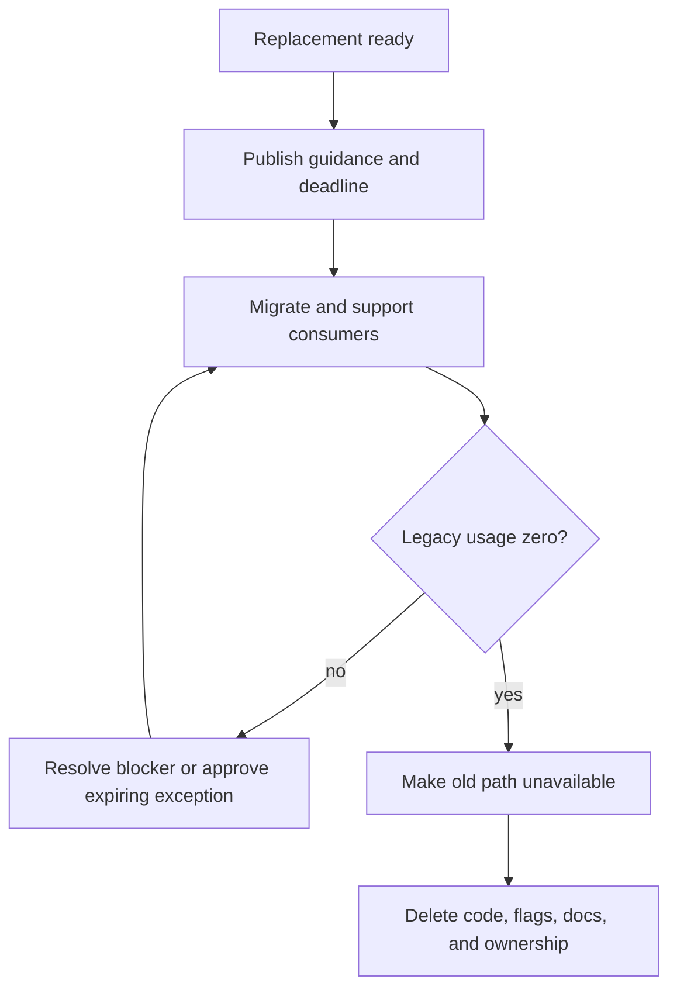

# Deprecation, Standards, and Team Coordination: Theory

[Concept overview](README.md) · [Interview questions](interview.md)

## Mental Model

Deprecation is a lifecycle for moving consumers from an old contract to a supported one.
A warning without a replacement, adoption support, usage signal, deadline, and removal
owner only documents permanent duplication.

Standards work when the preferred path is usable, enforced at the right boundary, and
open to time-limited exceptions. Coordination turns those rules into sequenced work
across teams.



Removal is part of the plan, not optional cleanup after the interesting work.

## Make the Replacement Ready

Before deprecating, prove that the new path covers required use cases. Provide:

- a clear capability contract and ownership boundary;
- migration examples for common and difficult consumers;
- compatibility and version policy;
- diagnostics that point to the replacement;
- support channel and escalation owner;
- a way to verify behavior before switching.

If the replacement lacks a required capability, record that gap rather than forcing a
private workaround. Widespread exceptions usually mean the standard is incomplete or
the migration deadline is unrealistic.

## Express Deprecation in Code and Policy

Swift's `@available` attribute can mark an API deprecated and provide `renamed` or
`message` guidance. Use a message that tells the caller what to do, not only that the API
is old.

```swift
@available(
    *,
    deprecated,
    renamed: "ProfileRepository.profile(id:)"
)
func loadProfile(_ id: Profile.ID) async throws -> Profile {
    try await profileRepository.profile(id: id)
}
```

Keep the compatibility implementation thin. New business rules should live in the target
path. If the old API forwards safely, it can support a transition. If forwarding changes
behavior, document the difference and require explicit migration.

For internal modules, pair compiler warnings with import restrictions, architecture
tests, build warnings for new use, or code-owner review. Enforcement should stop new debt
before it blocks existing consumers that still have an approved migration window.

## Measure Adoption

Maintain an inventory of consumers with team, use case, version, migration status,
blocker, and deadline. Static source search helps, but runtime lookup, reflection, server
calls, older app versions, and generated code may need telemetry or compatibility logs.

Track remaining callers and old-path traffic. A percent migrated can hide one high-risk
consumer. Removal requires zero required use, not a favorable average.

Avoid collecting sensitive payloads merely to measure adoption. Capability identity,
version, caller module, and outcome are often enough.

## Coordinate Without Permanent Committees

Define roles:

- the provider owns replacement quality, tooling, support, and final removal;
- each consumer team owns its migration and product validation;
- release or platform owners coordinate shared timing and compatibility;
- an escalation owner decides disputed exceptions and priority.

Publish milestones and dependency order. Hold short decision-focused reviews around
blockers rather than status meetings that repeat dashboards. Make migration work visible
in team planning so product delivery does not continuously displace it.

## Standards and Exceptions

A useful standard states the problem, default, scope, evidence, enforcement, and escape
hatch. It should not prescribe internal structure that has no cross-team consequence.

An exception needs:

- a concrete reason the standard does not fit;
- an accountable owner;
- affected scope and risk control;
- expiry or review date;
- plan to converge or update the standard.

Exceptions provide feedback. Repeated similar exceptions may justify a supported
extension point. One unusual legacy constraint may remain local and time-boxed.

## Removal and Compatibility Windows

Choose deadlines from release reality. Internal source consumers may migrate quickly.
Published SDKs, packages, backend contracts, and mobile clients need versioned windows.
Removing a server field when a supported old app still needs it is a production break,
even if the current repository has no callers.

Use additive changes before removals. Stop creating new consumers, migrate active ones,
observe old traffic, then remove after the support window. For Swift packages, align
breaking source changes with the package's versioning contract.

When usage reaches zero, remove the symbol, adapter, flag, metrics, tests for the old
path, and outdated examples. Keeping dead compatibility code increases future change and
security cost.

## Pros and Cons

| Benefits | Costs and risks |
|---|---|
| Clear lifecycle prevents permanent parallel paths | Provider and consumers need funded work |
| Diagnostics make migration self-service | Warnings can become ignored noise |
| Usage evidence supports safe removal | Static analysis may miss runtime consumers |
| Exceptions reveal gaps without blocking all work | Unowned exceptions become permanent forks |

At Staff scope, design the migration experience and help teams converge. At Principal
scope, align incentives, version policy, support windows, and decision ownership across
the organization. The standard succeeds when teams can follow it without repeated local
interpretation.

## References

- [The Swift Programming Language: Attributes](https://docs.swift.org/swift-book/documentation/the-swift-programming-language/attributes/)
- [Swift compiler: Deprecated declaration warnings](https://docs.swift.org/compiler/documentation/diagnostics/deprecated-declaration/)
- [Swift API Design Guidelines](https://www.swift.org/documentation/api-design-guidelines/)
