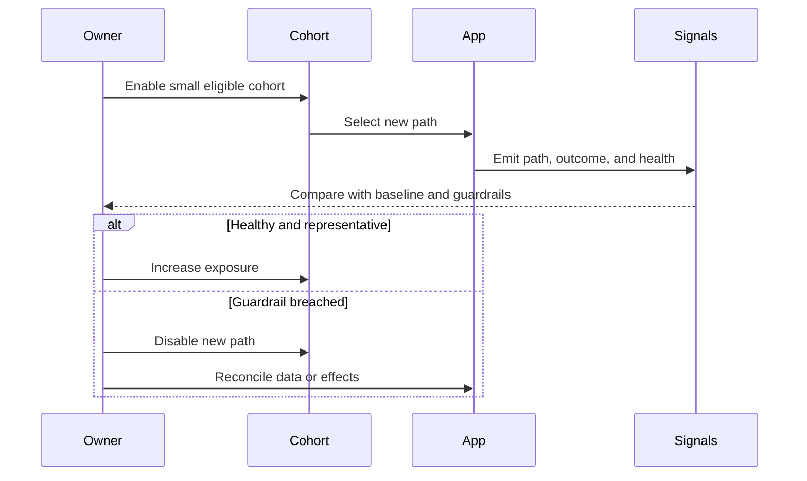

# Rollout, Observability, and Reversal: Theory

[Concept overview](README.md) · [Interview questions](interview.md)

## Mental Model

Deployment puts code on devices. Activation chooses who uses the new behavior. Validation
decides whether the migration is healthy. Reversal limits harm when it is not.

Treat these as separate controls when the change has meaningful risk. Define evidence
before rollout, increase exposure in stages, and preserve a tested fallback until data
and external effects make reversal safe or no longer useful.

The control plane is only one part of reversal. A flag cannot restore data that the new
path changed incompatibly.

## Define Evidence Before Exposure

Choose three kinds of signals:

- **Outcome:** Did the intended product or engineering result improve?
- **Guardrail:** Did crashes, hangs, correctness, latency, memory, battery, or support
  outcomes regress?
- **Migration:** Which path ran, whether fallback occurred, and why results differed?

Define baseline, threshold, cohort, observation window, and decision owner. An average
can hide a severe regression on older devices, large accounts, accessibility flows, or
poor networks. Segment only by dimensions that affect the decision and can be collected
safely.

Logs explain individual events. Metrics show population trends. Traces connect work
across boundaries. User reports catch failures the instrumentation did not predict. Use
the smallest set that can answer the rollout decision.

Apple's current MetricKit APIs can attribute performance metrics to feature or app state.
Use such system telemetry alongside product correctness signals. Performance health does
not prove equivalent behavior.

## Choose Rollout Controls

| Control | What it limits | Important limit |
|---|---|---|
| Internal or TestFlight cohort | Early device and workflow exposure | Not representative of all production users |
| Server-side feature flag | Behavior by account or cohort | Requires networked policy and safe defaults |
| Deterministic local assignment | Stable offline cohort | Harder to change immediately |
| App Store phased release | Automatic-update distribution by version | Manual downloads remain available |
| Backend routing | Server implementation or response form | Old clients still need compatible contracts |

App Store phased release currently spreads automatic updates over seven days and can be
paused. It is not a complete feature rollout: users can manually install the version, and
it cannot select one architecture path inside a binary.

Use stable cohort assignment so users do not switch behavior unpredictably between
launches. Exclude accounts or states that cannot safely run the new path. Version remote
configuration and choose a conservative last-known or offline default.

## Make Reversal Real

Reversal options include disabling a runtime path, routing the server back, shipping a
fixed app version, or operating a compatibility reader. Test the intended path before
production.

Classify the change:

1. **Code-only and stateless:** a flag may provide quick reversal.
2. **Additive data change:** old code may continue if it ignores the new fields.
3. **Destructive or meaning-changing data change:** rollback needs backup, reverse
   migration, dual reader, or forward repair.
4. **External side effect:** use idempotency, acknowledgement, or compensation; a flag
   cannot undo a completed action.

Do not call a plan reversible when it only hides the new UI while corrupted or
incompatible state remains. Define the last safe reversal point and the forward-fix plan
after that point.

## Compare Old and New Paths

For deterministic reads, run both paths for a small cohort and compare normalized output.
Avoid doubling effects. For writes, compare validation decisions in shadow mode or use a
non-committing environment.

Record the selected path and implementation version with every migration signal. Without
that context, a global crash or latency graph cannot show whether the new architecture
caused the change.

Watch fallback rate. A healthy headline metric can hide a new path that fails often but
silently falls back to legacy. Fallback is a safety mechanism and a migration failure
signal.

## Operate the Rollout

Use explicit stages with entry and exit criteria. A typical order is team devices,
pre-production testers, small production cohort, representative larger cohorts, then full
activation. Hold long enough to observe the chosen signal, but avoid arbitrary waiting
when evidence arrives faster.

Automate safe guardrails where the signal is timely and reliable. Keep a human decision
for ambiguous correctness or data changes. Document who can pause, the expected response
time, and the communication channel.

After full activation, keep fallback only for the agreed confidence window. Long-lived
flags multiply test combinations and keep obsolete dependencies alive. Remove the flag,
old implementation, comparison metrics, and emergency procedures together.

## Pros and Cons

| Benefits | Costs and risks |
|---|---|
| Cohorts limit blast radius | Flags and dual paths increase test combinations |
| Evidence replaces opinion | Weak metrics can create false confidence |
| Reversal reduces recovery time | Data and side effects may not be reversible |
| Path-specific signals expose drift | Instrumentation and privacy review add work |

At Staff and Principal scope, rollout is part of architecture design. Align mobile,
backend, data, support, and release owners before activation. A technically sound path
without decision rights and incident ownership is not operationally safe.

## References

- [Apple: Release a version update in phases](https://developer.apple.com/help/app-store-connect/update-your-app/release-a-version-update-in-phases)
- [Apple: Monitoring app performance with MetricKit](https://developer.apple.com/documentation/metrickit/monitoring-app-performance-with-metrickit)
- [Martin Fowler: Feature Toggles](https://martinfowler.com/articles/feature-toggles.html)
