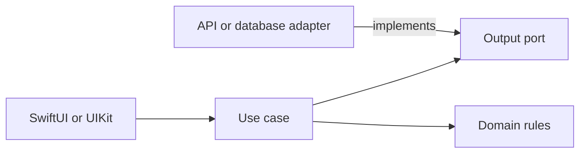

# Dependency Rule and Use-Case Boundaries: Theory

[Concept overview](README.md) · [Interview questions](interview.md)

## Mental Model

Clean Architecture protects product policy from delivery and infrastructure details.
Source dependencies point inward: UI, network, persistence, and SDK adapters know the
application contracts; the application core does not know their concrete types.

Runtime calls can travel both ways. A use case calls an output port implemented by an
outer adapter. The implementation depends on the port, so the source dependency still
points toward the application.



The diagram is not a required number of layers. The rule is which decisions may know
about which other decisions.

## Define a Use Case Around Product Meaning

A use case represents an application operation such as submitting an order, restoring
a draft, or transferring ownership. It coordinates domain rules, dependencies, and
the operation's result:

```swift
struct SubmitOrder: Sendable {
    let orders: OrderSubmitting
    let now: @Sendable () -> Date

    func callAsFunction(_ draft: OrderDraft) async throws -> Receipt {
        let order = try draft.validatedOrder()
        return try await orders.submit(order, requestedAt: now())
    }
}
```

The use case speaks in product types. It does not know endpoint paths, JSON, managed
objects, alerts, or navigation. Validation that must remain true across presentations
belongs in domain types or the use case. Display validation such as which field gets
focus remains in presentation.

A use case can be a function or small value. It does not require an `Interactor`
class, one protocol per method, or separate request and response types when ordinary
Swift values already express the contract.

## Point Dependencies Toward Stable Policy

If `SubmitOrder` imports a concrete `HTTPClient`, changes to transport can affect the
application core. Instead, the consumer owns a narrow output contract:

```swift
protocol OrderSubmitting: Sendable {
    func submit(_ order: Order, requestedAt: Date) async throws -> Receipt
}

struct HTTPOrderAdapter: OrderSubmitting {
    let client: HTTPClient

    func submit(_ order: Order, requestedAt: Date) async throws -> Receipt {
        let response = try await client.post(
            OrderRequest(order, requestedAt: requestedAt),
            to: "/orders"
        )
        return try response.receipt()
    }
}
```

The outer adapter translates between application and HTTP concepts. An app composition
root constructs the concrete graph. Dependency injection changes construction; the
dependency rule changes knowledge.

Direct concrete dependencies remain appropriate for stable inner values. Creating a
protocol for every formatter or domain type adds indirection without protecting a
volatile boundary.

## Keep Frameworks at the Edge

The core should be testable without launching UI or opening a real database. Avoid
returning `View`, `UIImage`, `NSManagedObject`, `ModelContext`, `URLRequest`, or vendor
SDK values from use cases. Translate them at adapters.

Framework independence is not an absolute ban on Foundation. `Date`, `Decimal`, and
`URL` may be acceptable when their meaning matches the domain and replacement has no
value. Decide from coupling and semantics, not a purity checklist.

## Choose Boundary Strength

Folders communicate the dependency rule but do not enforce it. Swift access control
can hide implementation inside a module or package. Separate targets make forbidden
imports compiler errors, at the cost of public API work and a larger build graph.

Start with the lightest enforcement that protects the risk. A small team may use one
module with focused types and tests. Multiple teams or recurring dependency leaks may
justify packages and automated dependency checks.

## Pros and Cons

| Benefits | Costs and risks |
|---|---|
| Product rules survive UI and data-source change | More contracts and composition |
| Use cases have fast focused tests | Trivial operations can become ceremony |
| Infrastructure failures map at one edge | Mapping and error translation add work |
| Dependency direction clarifies ownership | Too many modules slow builds and evolution |
| Multiple adapters can share one application port | Premature abstractions may model guessed change |

Clean boundaries fit important policy, several delivery mechanisms, volatile external
systems, or team ownership. Direct feature-to-service code may be clearer for simple,
low-risk behavior with one stable implementation.

## Engineering Decisions

Ask what change the boundary contains, which policy remains inward, who owns the
contract, and how errors and cancellation cross. Test use cases with small fakes and
test adapters separately against real schemas or stores.

At Staff scope, define a few enforceable dependency rules, module owners, compatibility
expectations, and exceptions. Avoid a universal central domain module; feature-oriented
cores reduce coordination and let policy evolve with its owner.

## References

- [Hexagonal Architecture — original article](https://alistair.cockburn.us/hexagonal-architecture)
- [Access Control — The Swift Programming Language](https://docs.swift.org/swift-book/documentation/the-swift-programming-language/accesscontrol/)
- [Introducing Packages — Swift Package Manager](https://docs.swift.org/swiftpm/documentation/packagemanagerdocs/introducingpackages/)
