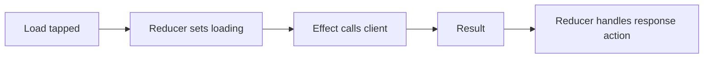

# Effects, Dependencies, and Cancellation: Theory

[Concept overview](README.md) · [Interview questions](interview.md)

## Mental Model

The reducer owns the decision to start work, not the work itself. It updates immediate
state and returns an effect. The store runs that effect, and the effect sends actions
back when meaningful events occur. The reducer then handles those events through the
same state-transition path as user input.



This makes the lifecycle visible. It also prevents an escaping task from mutating the
reducer's `inout` state after the synchronous transition has ended.

## Return Effects from Decisions

Current TCA uses `.run` for async work. Capture the values the operation needs before
the effect begins:

```swift
@Dependency(\.itemsClient) var itemsClient

private enum CancelID { case load }

case .loadButtonTapped:
    let category = state.category
    state.isLoading = true

    return .run { send in
        do {
            let items = try await itemsClient.load(category)
            await send(.loadResponse(.success(items)))
        } catch is CancellationError {
            // Cancellation is a lifecycle event, not a user-facing failure.
        } catch {
            await send(.loadResponse(.failure(.requestFailed)))
        }
    }
    .cancellable(id: CancelID.load, cancelInFlight: true)
```

The response action clears loading and applies the result. Do not mutate state inside
the async closure. Do not start a loose `Task` inside the reducer; that work would sit
outside the store's effect lifetime and testing tools.

Use `.none` when no effect is needed. A fire-and-forget operation may be appropriate for
best-effort logging, but most product work has an outcome worth modeling. Saving,
authorization, and analytics delivery can fail or affect later decisions.

## Define Dependencies by Capability

TCA's dependency system exposes registered values through `@Dependency`. A dependency
should describe the feature's needed capability, such as `loadProfile`, rather than
mirror every method of a networking SDK.

Provide:

- a live value for production integration;
- a deterministic test value or explicit override;
- a preview value when the live service is unsafe or unavailable.

Dependencies are declared at the reducer, but they are not constructor parameters.
This reduces plumbing through a large reducer tree and supports scoped overrides. The
cost is that the full object graph is less visible at initialization. Keep dependency
keys owned, named, and searchable. Do not use the dependency system as a global bag of
mutable application state.

Inject nondeterminism as well as services. Clocks, dates, UUIDs, randomness, locale,
and notification streams otherwise make tests timing-dependent. A controlled clock can
advance debounce or retry policy instantly without sleeping.

## Make Cancellation a Product Rule

TCA cancellation identifiers connect a running effect with later cancellation. Use
`cancelInFlight: true` for latest-request-wins behavior, such as search. Return an
explicit cancellation effect when a user action or lifecycle event must stop work.

The identifier must match the lifetime you intend. One global search ID makes all search
instances compete. Include feature or request identity when independent instances may
run concurrently. Conversely, a fresh random ID for every start cannot be used to cancel
the previous operation unless that ID is stored.

Cancellation is cooperative. Cancelling an effect requests cancellation of its task;
the dependency or underlying API must observe it. CPU work needs cancellation checks,
and callback wrappers need to cancel their underlying handle. Treat `CancellationError`
as a normal lifecycle outcome unless the product explicitly presents it.

Removing presented or optional child state ends its modeled lifetime. Effects that must
stop at that point need the matching lifecycle-aware composition or explicit
cancellation, and the dismissal path should be tested. Explicit IDs are still useful
for operations within a living feature, replacement, debounce, and shared resources.

## Handle Ordering and Failure

Cancellation alone does not define result ordering. An external operation may finish
despite cancellation. When stale data would be harmful, include request identity in the
response or check that the response still matches current state.

Map infrastructure errors to domain outcomes at the boundary. The reducer usually
needs decisions such as retryable, unauthorized, offline, or unknown. It rarely needs
a raw vendor error stored in feature state. Preserve detailed diagnostics in the adapter
or logging layer.

For long-lived streams, `.run` can send several actions. The effect must finish on
termination, and the dependency should bridge cancellation to the producer. Choose a
buffering or dropped-event policy in the dependency when the producer can outrun the
consumer.

## Pros and Cons

| Benefits | Costs and risks |
|---|---|
| Async results follow the action loop | More actions for request lifecycles |
| Dependencies are easy to override | Construction hides part of the object graph |
| Cancellation becomes testable policy | Incorrect IDs cause cross-feature interference |
| Clocks and IDs can be deterministic | Long-lived effects need careful cleanup |

At Staff scope, define dependency ownership and avoid one shared client module that
every feature can extend. Establish cancellation and error-mapping conventions, then
test races at feature boundaries. Pin and upgrade TCA deliberately because effect and
dependency APIs continue to evolve.

## References

- [The Composable Architecture README](https://github.com/pointfreeco/swift-composable-architecture)
- [TCA dependencies documentation](https://swiftpackageindex.com/pointfreeco/swift-composable-architecture/main/documentation/composablearchitecture/dependencies)
- [TCA concurrency documentation](https://swiftpackageindex.com/pointfreeco/swift-composable-architecture/main/documentation/composablearchitecture/swiftconcurrency)
