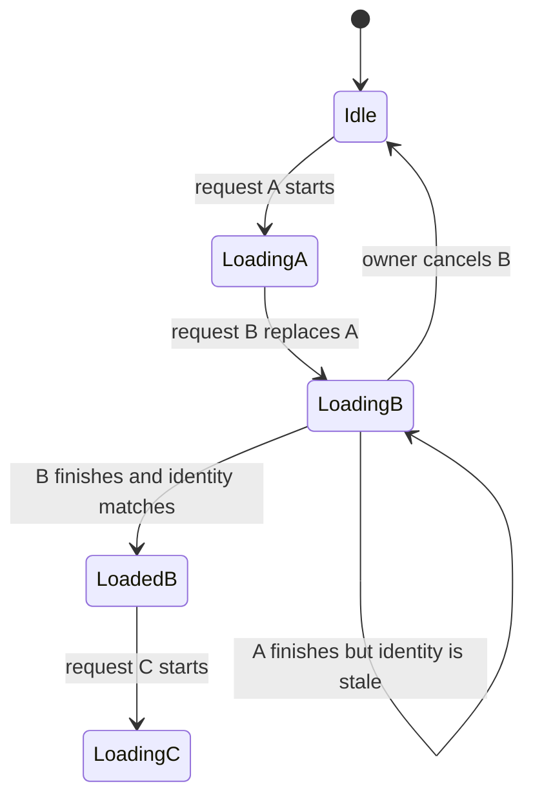

# Cancellation, Stale Results, and Logical Races: Theory

[Concept overview](README.md) · [Interview questions](interview.md)

## Mental Model

Cancellation is a request to stop work that is no longer useful. It is not a rollback,
an interrupt, or proof that code has stopped. Swift sets cancellation state; the task and
the async functions it calls must cooperate.

Cancellation also does not solve logical races. Two operations can be fully data-race
safe and still complete in an order that violates product intent. Protect the commit
point with current state or request identity.



Cancelling A reduces wasted work. The identity check is what prevents A from overwriting
B if A still returns.

## Cooperative Cancellation

`Task.cancel()` marks a task as cancelled. `Task.checkCancellation()` throws
`CancellationError`; `Task.isCancelled` lets non-throwing code choose its own exit. A
CPU-bound loop with no check can continue to completion.

Structured child tasks inherit cancellation from a cancelled parent. Unstructured tasks
created with `Task {}` or `Task.detached {}` need their own handle and cancellation policy.
An `await` is not itself a guaranteed cancellation check. The called operation decides
how it responds.

```swift
func buildIndex(from records: [Record]) async throws -> Index {
    var index = Index()

    for record in records {
        try Task.checkCancellation()
        index.insert(process(record))
    }

    return index
}
```

Check at safe, useful intervals. A critical write may need to complete atomically before
the function observes cancellation. Cleanup belongs in `defer` or a cancellation handler
when an underlying API needs immediate notification.

`withTaskCancellationHandler` can forward cancellation to a legacy request handle.
Its cancellation closure can run concurrently with the operation, so shared bridge state
still needs synchronization. Cancellation handlers do not make non-cancellable work
cancellable by themselves.

## Logical Races

A data race means unsynchronized memory access. A logical race means valid operations
produce the wrong business result because of timing. Actor isolation prevents concurrent
access to actor state, but actor reentrancy allows other operations to run while one is
suspended.

Common examples include:

- an older search response overwriting newer results;
- two refresh calls both seeing no in-flight request and starting duplicate work;
- a save response applying to an editor that has since opened another record;
- sign-out finishing while a delayed authenticated callback restores account state;
- a retry committing after the user has explicitly undone the operation.

Serial execution alone does not define which completion should win. The feature needs a
policy such as latest request wins, first successful result wins, deduplicate by key, or
apply only to an exact version.

## Guard the Commit Point

For replaceable work, cancel the previous task and record a stable identity for the new
attempt. Before changing state, verify both cancellation and identity.

```swift
@MainActor
final class SearchModel {
    private var task: Task<Void, Never>?
    private var requestID: UUID?
    private(set) var state: SearchState = .idle

    func search(_ query: String) {
        task?.cancel()

        let id = UUID()
        requestID = id
        state = .loading(query)

        task = Task { [weak self, repository] in
            do {
                let results = try await repository.search(query)
                try Task.checkCancellation()
                guard let self, self.requestID == id else { return }
                self.state = .loaded(query, results)
            } catch is CancellationError {
                // Replacement or feature teardown is expected.
            } catch {
                guard let self, self.requestID == id else { return }
                self.state = .failed(query, error.localizedDescription)
            }
        }
    }
}
```

The ID is stronger than comparing query text when the same query can be requested twice
under different filters or account state. A monotonic generation is also useful. For
editing or synchronization, compare a domain version or entity identity rather than a
UI request ID.

Keep the check and state mutation in one synchronous actor-isolated region. Do not check,
`await` again, and then commit without revalidation.

## Cancellation and External Effects

Cancellation cannot undo a server mutation that already committed. A cancelled client
may not know whether a request reached the server. Use idempotency keys for safe retries,
version checks for conflicting writes, and compensation when the domain supports undo.

Separate three decisions:

1. Should the local task keep consuming resources?
2. Is a returned result still allowed to update local state?
3. Did an external business operation commit, and how will the system reconcile it?

For a read-only search, cancellation and stale-result rejection may be enough. For a
payment or offline edit, the third question needs a durable protocol.

## State and Error Policy

Do not present ordinary replacement cancellation as a failure. If a refresh is cancelled
while old content remains valid, keep the old content. If an initial load is cancelled
because the screen disappeared, no UI update may be needed.

Avoid broad `catch` blocks that retry or show an alert for `CancellationError`. At the
same time, do not assume every error named “cancelled” has identical product meaning;
normalize dependency-specific errors at the boundary.

Tests should control completion order instead of relying on sleeps. Hold two request
continuations, complete the second first, then prove that completing the first cannot
change state. Test cancellation before start, during suspension, and immediately before
commit.

## Engineering Decisions

| Policy | Fits | Required guard |
|---|---|---|
| Latest request wins | Search, previews, replaceable refresh | Request generation or identity |
| Deduplicate by key | Token refresh, cache fill | Shared in-flight operation |
| Version must match | Editing and synchronization | Domain or server version |
| All results combine | Independent batch work | Stable result identity and merge rule |
| Durable intent continues | Offline mutation | Persistence, idempotency, reconciliation |

At Staff scope, make effect identity and cancellation part of shared API contracts. Track
cancelled work, stale results rejected, duplicate work, and latency after cancellation.
These signals reveal wasted capacity and unclear ownership without treating cancellation
as an application error.

## References

- [The Swift Programming Language: Task cancellation](https://docs.swift.org/swift-book/documentation/the-swift-programming-language/concurrency/#Task-Cancellation)
- [SE-0304: Structured Concurrency](https://github.com/swiftlang/swift-evolution/blob/main/proposals/0304-structured-concurrency.md)
- [Apple: `withTaskCancellationHandler`](https://developer.apple.com/documentation/swift/withtaskcancellationhandler%28operation%3Aoncancel%3Aisolation%3A%29)
- [SE-0306: Actor reentrancy](https://github.com/swiftlang/swift-evolution/blob/main/proposals/0306-actors.md#actor-reentrancy)
