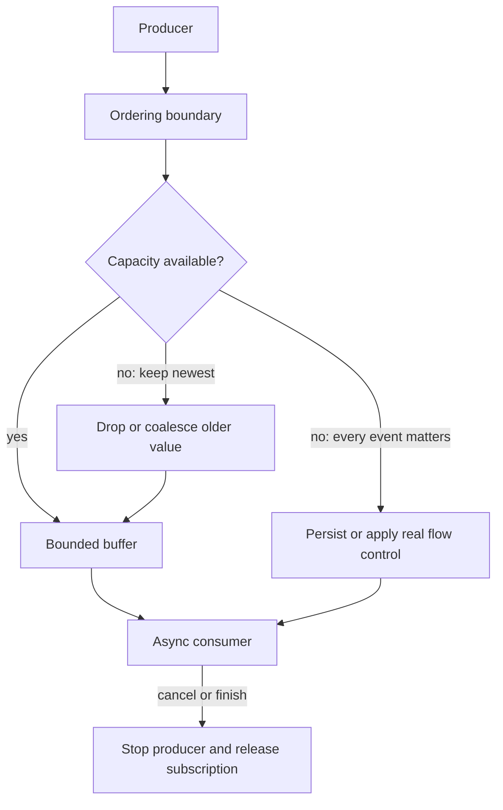

# Event Ordering, Streams, and Backpressure: Theory

[Concept overview](README.md) · [Interview questions](interview.md)

## Mental Model

A stream is a contract for values over time. Before choosing an API, define:

- the event identity and ordering domain;
- whether every value matters or newer values replace older ones;
- how producer speed is controlled;
- what happens when capacity is full;
- how completion, failure, and cancellation release resources.

`AsyncSequence` gives consumers an async pull interface. `AsyncStream` can adapt a push
source to that interface, but buffering does not automatically slow the producer.



The overflow branch is a product decision. Hiding it behind an unbounded queue only
delays the decision until memory or latency becomes a problem.

## Define Ordering Precisely

“Events are ordered” is incomplete. Ordered by which producer, clock, account, entity,
or server sequence? Concurrent producers can call a thread-safe continuation safely but
still produce an order that depends on timing.

If strict order matters, serialize production through one owner and attach a sequence or
version that the receiver can validate. Wall-clock timestamps are weak ordering tools
across devices because clocks differ and values can tie.

Choose a rule that matches the domain:

| Event type | Useful rule |
|---|---|
| UI search text | Latest value matters; older work may be cancelled |
| Sensor display | Bounded newest values; occasional drops may be acceptable |
| Chat messages | Stable server sequence with gap recovery |
| Account state | Versioned snapshot or ordered transitions per account |
| Payment or audit event | Persist every event; acknowledge and replay |

Do not merge unrelated ordering domains into one global queue. It creates head-of-line
blocking and an ownership bottleneck without improving correctness.

## AsyncSequence and AsyncStream

`AsyncSequence` lets the consumer request each next element with `for await`. The loop
can suspend between elements, and it ends when the sequence finishes, throws, or responds
to cancellation.

`AsyncStream` and `AsyncThrowingStream` are useful for delegates, callbacks, observation,
and other push sources. Keep control of the continuation, finish it when the source ends,
and release the source when the consumer terminates.

```swift
func updates() -> AsyncStream<Status> {
    // ObservationToken is Sendable.
    let (stream, continuation) = AsyncStream.makeStream(
        of: Status.self,
        bufferingPolicy: .bufferingNewest(1)
    )

    let token = monitor.observe { status in
        continuation.yield(status)
    }

    continuation.onTermination = { _ in
        token.cancel()
    }

    return stream
}
```

This policy fits state snapshots: only the newest status matters. It would be wrong for
audit records. The default `AsyncStream` buffer is unbounded, so choose it only when the
producer is known to be finite and the consumer can keep up.

A continuation's yield result can report whether a value was enqueued, dropped, or the
stream had terminated. Observe it when dropped values or production after termination
matter operationally.

## Backpressure and Overflow

Backpressure means the consumer can limit producer progress. A bounded `AsyncStream`
buffer is an overflow policy, not necessarily backpressure. A synchronous callback can
continue producing while the stream drops values.

Available strategies include:

- **Suspend or slow the producer:** best when the producer supports demand or async pull.
- **Buffer with a bound:** absorbs short bursts but needs an overflow rule.
- **Keep newest:** suitable for replaceable state such as progress or connectivity.
- **Keep oldest:** preserves early events but may leave the consumer far behind.
- **Coalesce:** combine repeated updates by key or meaning.
- **Batch:** reduce per-event overhead while preserving a defined set of events.
- **Persist and acknowledge:** required when losing an event is unacceptable.
- **Reject or shed load:** protects the system and makes capacity visible to callers.

An unbounded buffer converts a throughput mismatch into growing memory and stale latency.
A very large bound can hide the same issue. Measure queue depth, event age, drops, and
consumer processing time.

## Subscription Lifetime and Multiplicity

Decide whether a stream is cold or hot. A cold sequence starts independent work for each
consumer. A hot source exists independently and broadcasts or shares current events.
If several consumers subscribe to one `AsyncStream`, do not assume broadcast behavior;
design a fan-out owner with explicit per-subscriber buffering and termination.

Each subscription needs a cleanup path. When the consumer cancels, `onTermination`
should stop observation or remove that subscriber. When the producer ends, call
`finish()` or `finish(throwing:)`. A stream that never finishes can retain its producer
and leave consumers suspended.

Failures also need scope. A transport disconnect might finish the sequence, emit a
connection-state value, or trigger a supervised reconnect. Pick one contract and avoid
hidden infinite retries inside a generic stream helper.

## Architecture and Testing

Keep stream conversion at the infrastructure boundary. Translate framework notifications
or socket frames into domain events before features consume them. Reducers or main-actor
models should receive typed events and apply state transitions in one owned domain.

Test with a controlled producer. Verify event order, capacity overflow, termination,
consumer cancellation, producer failure, and reconnection. Avoid time-based sleeps when
you can yield values directly and await observable state.

At Staff scope, publish stream contracts that state ordering, delivery, buffering, and
failure guarantees. Shared infrastructure should expose drop and lag metrics and prevent
each feature from inventing an unbounded callback bridge.

## References

- [The Swift Programming Language: Async sequences](https://docs.swift.org/swift-book/documentation/the-swift-programming-language/concurrency/#Asynchronous-Sequences)
- [SE-0298: Async/Await Sequences](https://github.com/swiftlang/swift-evolution/blob/main/proposals/0298-asyncsequence.md)
- [SE-0314: AsyncStream and AsyncThrowingStream](https://github.com/swiftlang/swift-evolution/blob/main/proposals/0314-async-stream.md)
- [Apple: `AsyncStream.makeStream`](https://developer.apple.com/documentation/swift/asyncstream/makestream%28of%3Abufferingpolicy%3A%29)
- [Apple: `AsyncStream` buffering policy](https://developer.apple.com/documentation/swift/asyncstream/continuation/bufferingpolicy)
