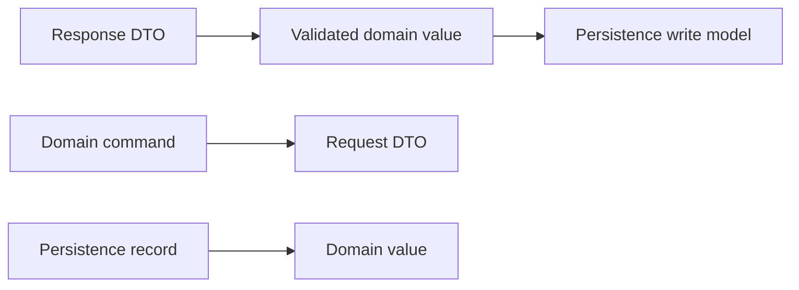

# Domain, Transport, and Persistence Mapping: Theory

[Concept overview](README.md) · [Interview questions](interview.md)

## Mental Model

One real-world concept can have several representations because each boundary serves a
different contract:

| Model | Optimized for | Changes when |
|---|---|---|
| Transport DTO | Wire keys, nullability, version, and payload shape | Service contract changes |
| Persistence record | Queries, indexes, relationships, migration, and storage limits | Local schema changes |
| Domain model | Valid product decisions and clear Swift API | Product rules change |

A mapping boundary translates and validates between these representations. It prevents
transport convenience or storage framework behavior from becoming an accidental product
rule.

## Keep External Models at the Edge

A transport model may need awkward key names, nested containers, optional fields, or an
unknown status string. `Codable` can synthesize straightforward decoding and supports
custom implementations when the encoded shape differs. Decoding only proves that the
payload matches Swift types; it does not prove that values form a valid domain object.

```swift
struct UserDTO: Decodable {
    let id: String
    let displayName: String?
    let status: String
}

struct User: Equatable, Sendable {
    let id: ID
    let displayName: NonEmptyString
    let status: Status
}
```

The mapper parses the ID, validates the name, and chooses how to handle an unknown
status. That decision can be reject, preserve as `.unknown(rawValue)`, or degrade a
specific capability. It should not be an accidental `fatalError` in a view.

A persistence type may be a SwiftData model, managed object, or database row. Keep its
relationships, lazy loading, context identity, and migration fields out of the domain.
Do not pass persistence-managed objects across actors or contexts. Map to immutable
values or pass a persistent identifier and refetch in the destination isolation domain.

## Preserve Meaning During Mapping

Boundary bugs often come from values that look similar:

- a missing key, explicit `null`, empty string, and default value;
- decimal money and binary floating-point;
- server timestamp, device clock, and display time zone;
- stable server ID, local temporary ID, and database row ID;
- unknown enum case and invalid value;
- absent patch field, clear-this-field, and set-this-value.

Swift's synthesized optional decoding commonly maps both a missing key and explicit null
to `nil`. If the protocol distinguishes them, use a custom representation with three
states. The same applies to partial updates: `Optional<T>` alone cannot express both “do
not change” and “set to nil.”

Centralize date, URL, decimal, and identifier parsing. Do not scatter fallback defaults
across mappers. A default is correct only when the contract assigns that meaning; using
zero for an absent price creates valid-looking wrong data.

## Map in the Direction of Use

Do not assume one reversible mapper serves every direction. A read DTO may contain
server-computed fields that a write request must omit. A persistence record may contain
sync metadata that the domain never sees.

Common paths are:



Place mapping beside the adapter that owns the external model. Keep shared domain
constructors or validation in the domain module. This direction prevents the domain
module from importing networking or persistence frameworks.

Batch mapping needs an explicit failure policy. For a financial ledger, one invalid row
may fail the whole batch. For a large catalog, the app might quarantine invalid records,
apply valid rows, report counts, and request repair. Never drop malformed data silently.

## Evolve Transport and Storage Safely

Transport evolution should prefer additive fields and tolerant readers where the product
allows them. The client still needs a minimum supported schema and a clear response to
incompatible data. Keep recorded fixtures from supported server versions.

Local persistence evolution requires a versioned schema and migration path. Mapping a
new record type does not migrate an existing store. SwiftData provides versioned schemas
and migration plans. Core Data supports lightweight, staged, and manual migration based
on the change.

Test migrations from stores created by shipped versions, not only from an empty current
schema. Define recovery for corrupt or unsupported stores. A rebuild is acceptable for a
true cache; it is data loss for unsynced user content.

During staged client-server rollout, old clients may write the old shape while new
clients read the new one. Compatibility must cover both directions until the supported
old population is retired.

## Consider Cost without Removing the Boundary

Mapping large graphs can add allocations and repeated work. Use projections, batch
fetches, and incremental decoding when measurement shows a problem. Perform heavy decode
and mapping away from the UI actor, then cross isolation with `Sendable` values.

Do not remove all mapping to save a few copies before profiling. Sharing one mutable
persistence object across UI, sync, and transport creates stronger coupling and often
more expensive correctness bugs.

For a small stable payload that already matches a value domain model, one type can be
proportional. Record that choice and split it when external nullability, storage metadata,
or product rules diverge.

## Pros and Cons

| Benefits | Costs and risks |
|---|---|
| External schemas cannot directly weaken domain rules | More types and conversion code |
| Storage and service evolve independently | Mappers require fixtures and maintenance |
| Concurrency boundaries carry safe values | Large graph mapping can allocate heavily |
| Invalid data fails at a named boundary | Poor fallback policy can hide server defects |

At Staff scope, assign schema and mapper ownership, publish compatibility windows, and
track decode failures by endpoint and version without logging sensitive payloads. Couple
server rollout, client support policy, and local migration testing in one plan.

## References

- [Encoding, decoding, and serialization](https://developer.apple.com/documentation/swift/encoding-decoding-and-serialization)
- [Encoding and decoding custom types](https://developer.apple.com/documentation/foundation/encoding-and-decoding-custom-types)
- [SwiftData `VersionedSchema`](https://developer.apple.com/documentation/swiftdata/versionedschema)
- [Core Data staged migrations](https://developer.apple.com/documentation/coredata/staged-migrations)
