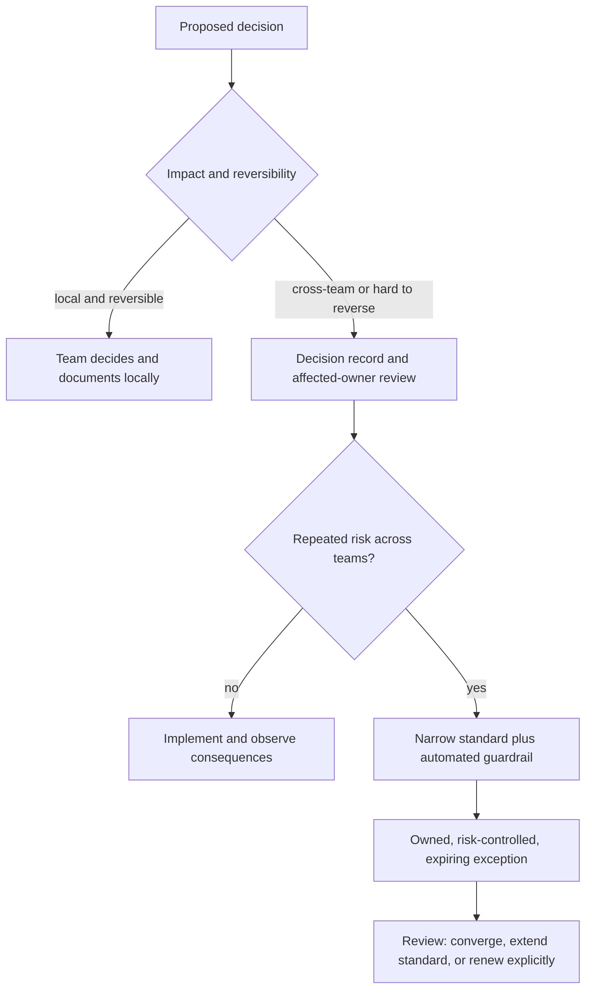

# Architecture Decisions, Standards, and Exceptions: Theory

[Concept overview](README.md) · [Interview questions](interview.md)

## Mental Model

Governance assigns decision rights and preserves reasoning. Local, reversible choices stay
with the team. Cross-team, expensive, or hard-to-reverse choices need broader review and
a durable record. Repeated high-cost choices may become standards with automated checks.

This model avoids two failures: a central committee approving every detail, and local
choices creating system-wide incompatibility without coordination.

## Match Process to Decision Cost

Consider blast radius, reversibility, security and privacy, public API stability, data
compatibility, operational ownership, and number of affected teams. A naming choice in
one feature is not the same as selecting an organization-wide persistence contract.

A useful decision record contains:

- context and required outcome;
- constraints and affected owners;
- options considered and selection criteria;
- the decision and its positive and negative consequences;
- implementation and migration outline;
- owner, status, and review or supersession trigger.

Keep it short enough to read during implementation. Record the reason that code cannot
show, not a full design specification. When the decision changes, preserve its history
and link the superseding decision.

## Turn Decisions into Standards Carefully

Standardize when repeated variation creates real cost: incompatible analytics events,
unsafe credential handling, inconsistent module boundaries, several networking stacks,
or public APIs without version policy.

A standard should define its scope, required outcome, default path, enforcement, owner,
support, migration, and exception process. It should not require one internal class
layout when teams can meet the system contract in several safe ways.

Use the strongest practical enforcement:

| Rule | Useful enforcement |
|---|---|
| Package dependency direction | Build graph or architecture test |
| Deprecated API | Compiler diagnostic and usage inventory |
| Required telemetry fields | Contract test or schema validation |
| Security-sensitive configuration | Build or deployment policy |
| Context-dependent design choice | Review checklist and decision record |

Do not automate judgment that the tool cannot evaluate reliably. Noisy rules teach teams
to ignore governance.

## Treat Exceptions as Feedback

An exception needs a concrete constraint, accountable owner, limited scope, risk control,
expiry, and path to converge or change the standard. Silent forks are not exceptions;
they are untracked architecture.

Repeated similar exceptions may show that the paved path lacks a real capability. One
unusual regulatory or legacy constraint may remain local. Review evidence instead of
measuring governance by how few exceptions exist.

Escalation should be clear and rare. A distant approver should not own a consequence they
will never support.

## Operate the Decision System

Review decisions when their assumptions change, not on arbitrary schedules alone. Useful
triggers include a new platform requirement, repeated incident, major scale change,
vendor change, missed outcome, or several exceptions.

Track decision lead time, exception age, violations prevented, migration completion, and
whether standards reduce duplicated work. Document count is not an outcome.

## Benefits and Costs

| Benefits | Costs and risks |
|---|---|
| Reasoning survives team changes | Records can become approval paperwork |
| Narrow standards reduce repeated risk | Over-standardization removes useful autonomy |
| Automated rules keep decisions alive | Weak checks create noise or false safety |
| Exceptions expose missing capabilities | Unowned exceptions become permanent divergence |

At Principal scope, design the decision system so authority follows consequence. The goal
is faster safe decisions across teams, not control for its own sake.

## References

- [Architecture Decision Record resources](https://github.com/architecture-decision-record/architecture-decision-record)
- [Markdown Architectural Decision Records](https://adr.github.io/madr/)
- [Swift API Design Guidelines](https://www.swift.org/documentation/api-design-guidelines/)
