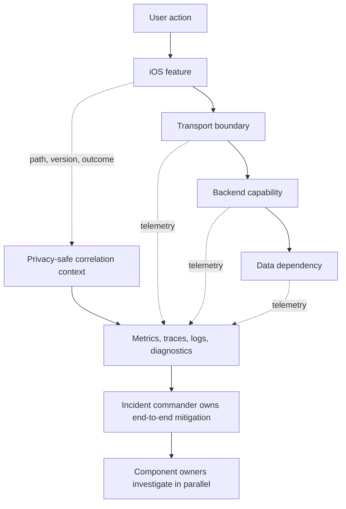

# Observability, Resilience, and Incident Boundaries: Theory

[Concept overview](README.md) · [Interview questions](interview.md)

## Mental Model

Users experience journeys, not components. Design observability around outcomes that cross
the app, network, services, and storage. Design resilience at owned boundaries so one
failure does not consume every retry, thread, queue, or user action.

During an incident, one role coordinates the user outcome while component owners
investigate and mitigate their parts.

Correlation should identify a workflow without putting credentials or personal data into
telemetry propagated across systems.

## Observe User Outcomes

Start with a small set of service-level indicators for important journeys: successful
completion, correct result, latency, freshness, and availability of a supported degraded
mode. Component CPU or endpoint uptime can explain behavior, but they are not the outcome.

Use metrics for trends, logs for events, traces for causal paths, and diagnostics for
crashes or resource failures. Apple MetricKit provides real-device reports and can
attribute supported metrics to reported app states.

Add app version, path, feature state, and relevant device or network class when they
change a decision. Avoid high-cardinality values, secrets, and unnecessary personal data.

## Put Resilience at Boundaries

Each dependency call needs a time budget, failure class, cancellation, and fallback.
Retries must be bounded, safe to repeat, and coordinated across layers.

Useful techniques include:

| Technique | Fits | Risk |
|---|---|---|
| Timeout budget | Prevent one dependency consuming the whole journey | Too short rejects valid slow work |
| Bounded retry with jitter | Temporary, safe-to-repeat failure | Amplifies outage without shared budget |
| Circuit or admission control | Protect unhealthy or saturated dependency | Rejects work and needs recovery policy |
| Cached or reduced experience | Read path with acceptable stale or partial data | Can hide freshness or correctness loss |
| Durable queue | Important intent that may complete later | Requires idempotency and reconciliation |

Define where degradation is acceptable. A stale recommendations panel may be fine. A
permission, price, or payment confirmation may require a clear unavailable state.

## Assign Incident Boundaries

For an end-to-end outage, one incident commander coordinates severity, mitigation,
communication, and decisions. Component owners investigate in parallel.

Before incidents, define:

- alert, journey, severity, and escalation ownership;
- safe flags, fallbacks, and rollback procedures;
- cross-component dashboards, communication, and handoffs.

Avoid alerts with no actionable owner. Also avoid paging several teams independently for
the same symptom without one coordinating role.

## Learn and Change the System

A post-incident review covers detection, impact, contributing conditions, mitigation,
communication, and why defenses did not limit the failure.

Actions need an owner and verification. Improve detection, runbooks, contracts, rollout,
or organization when those factors changed the impact.

Reliability targets help balance delivery and risk. An error-budget policy can trigger
stability work when actual outcomes consume the agreed budget, but the indicator must
represent user experience closely enough to guide decisions.

## Benefits and Costs

| Benefits | Costs and risks |
|---|---|
| Journey signals expose cross-system failures | Correlation and storage add privacy and cost concerns |
| Owned resilience limits blast radius | Fallbacks and retries create extra states to test |
| Clear incident command speeds decisions | Central command needs practiced component responders |
| Verified actions convert incidents into learning | Unprioritized action lists become recurring paperwork |

At Principal scope, align boundaries, telemetry, on-call ownership, and product
expectations so failures do not fall between teams.

## References

- [OpenTelemetry: Observability primer](https://opentelemetry.io/docs/concepts/observability-primer/)
- [OpenTelemetry: Context propagation](https://opentelemetry.io/docs/concepts/context-propagation/)
- [Apple: Monitoring app performance with MetricKit](https://developer.apple.com/documentation/metrickit/monitoring-app-performance-with-metrickit)
- [Google SRE: Incident management guide](https://sre.google/resources/practices-and-processes/incident-management-guide/)
- [Google SRE: Embracing risk](https://sre.google/sre-book/embracing-risk/)
