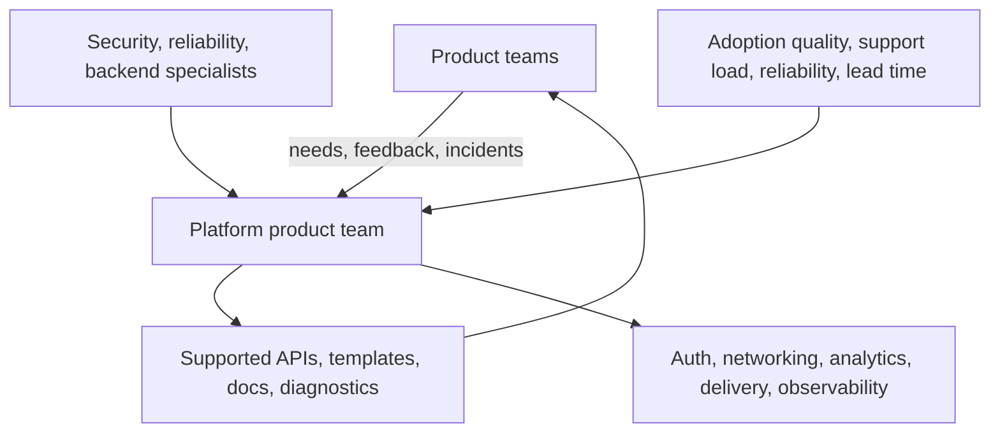

# Platform Teams, Shared Capabilities, and Ownership: Theory

[Concept overview](README.md) · [Interview questions](interview.md)

## Mental Model

A platform team turns repeated technical needs into a supported internal product. It owns
the interface and developer experience around shared capabilities, even when another
provider owns part of the underlying implementation.

Centralization must reduce more cost and risk than the coordination it adds.

The platform is a feedback system. Shipping a shared library without support, migration,
or outcome measurement is only code centralization.

## Choose What to Centralize

Good candidates are common across many teams, require scarce expertise, carry significant
security or reliability risk, and benefit from consistent integration. Examples include
authentication, release tooling, observability conventions, API transport, experimentation,
and secure storage.

Keep product-specific rules with product teams. A platform can provide an authorization
capability without deciding which user may edit a particular business object. It can
provide analytics transport without owning every event's product meaning.

Start with a thin capability that solves observed pain. A roadmap based only on central
assumptions can produce a polished system that teams avoid.

## Define the Service Contract

For each capability, define:

- supported entry points, compatibility, and version policy;
- provider, consumer, reliability, and incident responsibilities;
- diagnostics, documentation, migration, and support;
- escape hatch and contribution model.

Consumers still own correct use, product validation, and feature-level fallback. The
platform owns defects and operational health within its contract. Shared responsibility
must name the exact boundary; otherwise each side assumes the other is responding.

## Design for Self-Service

The common path should be discoverable, safe by default, and diagnosable without opening
a ticket. Prefer small APIs, validated configuration, templates, actionable errors,
standard dashboards, and migration automation.

The platform team studies integration failures and turns repeated questions into better
contracts or tooling. Repeated support is product evidence.

Avoid mandatory adoption before the path covers real needs. Teams will create hidden
forks or wait in a central backlog. Use a published exception with ownership when the
platform cannot yet fit a valid requirement.

## Ownership and Contribution

A platform bottlenecks when only its core team can change anything. Provide contribution
paths for product teams while the platform owner maintains contract coherence, review,
release, and support.

Ownership covers API, runtime, migration, support, and incident escalation. A repository
owner alone is not enough across mobile and backend systems.

## Measure Value

| Signal | What it can reveal |
|---|---|
| Integration lead time | Whether the platform removes setup work |
| Support requests by cause | Missing docs, diagnostics, or capability |
| Adoption and exception reasons | Fit, not just mandate compliance |
| Reliability and incident impact | Operational quality of shared paths |
| Duplicate local implementations | Gaps or poor migration support |
| Product delivery and defect trend | Whether centralization improves outcomes |

Do not use adoption alone. A mandatory platform can have high adoption and poor developer
experience. Combine usage with quality, support cost, and delivery outcomes.

## Benefits and Costs

| Benefits | Costs and risks |
|---|---|
| Expertise and safe defaults benefit many teams | Central backlog can slow product work |
| Shared fixes reduce duplicated maintenance | Failure can affect a large part of the app |
| Consistent telemetry and contracts improve operations | Platform evolution needs compatibility discipline |
| Self-service reduces cognitive load | Product policy may leak into a generic layer |

At Principal scope, fund customer research, operations, and migration. Without that
ownership, prefer smaller shared components over calling the result a platform.

## References

- [CNCF Platforms White Paper](https://tag-app-delivery.cncf.io/whitepapers/platforms/)
- [CNCF Platform Engineering Maturity Model](https://tag-app-delivery.cncf.io/whitepapers/platform-eng-maturity-model/)
