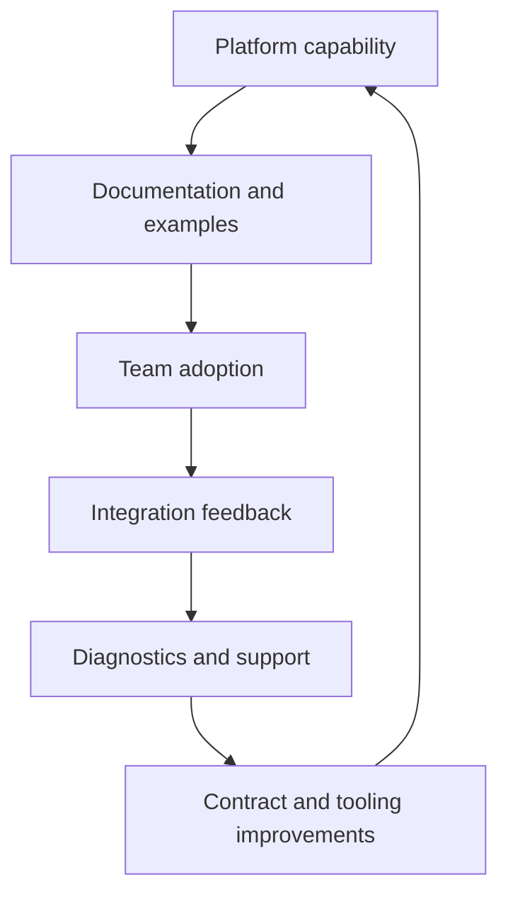

# Adoption, Governance, and Developer Experience: Theory

[Concept overview](README.md) · [Interview questions](interview.md)

## Mental Model

A platform is adopted when it makes product teams faster and safer than their
local alternatives. Governance is the set of rules that keeps shared architecture
coherent without blocking justified product needs.

Developer experience is not polish after the architecture is done. It is how the
architecture becomes usable.

## Adoption System

The platform team should own more than reusable code. It should own onboarding,
versioning, support channels, migration plans, compatibility tests, and a clear
process for exceptions.

| Concern | Architecture response |
|---|---|
| Slow adoption | Templates, examples, and migration support |
| Misuse | Smaller APIs, diagnostics, compile-time constraints |
| Local workarounds | Exception process and missing-capability backlog |
| Support load | Better logs, ownership metadata, self-service checks |
| Fragmentation | Standards, deprecation policy, and compatibility tests |

## Governance

Good governance defines defaults and escape hatches. A standard that cannot be
overridden becomes a blocker. A standard that is never enforced becomes a
suggestion.

Useful governance artifacts include:

- Approved extension-point patterns.
- Public API review checklist.
- Versioning and deprecation policy.
- Required diagnostics and telemetry.
- Contract test suite.
- Exception template with owner, expiry, and removal path.

At Staff scope, this means proposing conventions that teams can follow. At
Principal scope, it means creating the operating model that keeps conventions
alive across teams and releases.

## Production Application

Measure whether the platform is improving outcomes. Useful signals include
integration time, number of adopting teams, defects by integration phase,
production incidents, support tickets, API churn, and time to remove deprecated
paths.

Do not measure adoption alone. A platform can have high adoption because it is
mandatory while still creating support cost. The better signal is whether teams
can deliver features with fewer defects and less duplicated infrastructure.

## References

- [Swift API Design Guidelines](https://www.swift.org/documentation/api-design-guidelines/)

