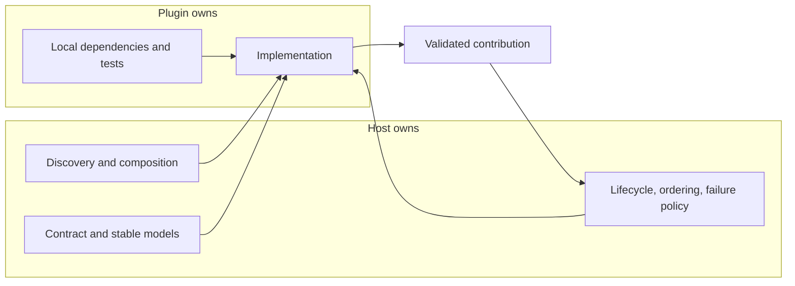

# Extension Points and Plugin Contracts: Theory

[Concept overview](README.md) · [Interview questions](interview.md)

## Mental Model

A plugin system separates a stable host from independently changing contributors. The
host publishes extension points. Plugins implement those contracts and contribute
behavior without reaching into host internals.

The contract is more important than registration. In many iOS codebases, a "plugin" is
an in-process Swift module selected at build time and registered at composition. An OS app
extension is different: Apple defines or the app declares an extension point, and the
extension runs with a separate lifecycle and process boundary. A Swift Package Manager
build plugin is different again; it participates in the build, not the app's runtime.

Name the model before discussing isolation, discovery, updates, or failure containment.

## Contract Shape

## Define the Contract

A good extension point gives a plugin only the context required for one capability. Use
stable value models or narrow protocols. Passing a service container, navigation stack,
database, or mutable application state turns the boundary into privileged host access.

| Contract decision | Question to answer |
|---|---|
| Capability and context | What may the plugin do, and which data may it see? |
| Discovery and identity | How is it registered, selected, and attributed? |
| Lifecycle | Who creates, starts, cancels, and releases it? |
| Concurrency | Which actor owns calls and results? May calls overlap? |
| Ordering | Can several plugins contribute, and who resolves conflicts? |
| Failure | Is failure isolated, skipped, retried, or fatal to the host operation? |
| Compatibility | Which host and contract versions can work together? |
| Observability | How are latency, errors, and use attributed without exposing secrets? |

The host should validate contributions before applying them. It also owns security and
privacy policy because a plugin cannot grant itself broader access.

## Engineering Decisions

Use a plugin boundary when several implementations change independently, contributors
need a stable integration path, or the host must accept capabilities it should not know in
advance. Examples include team-owned home sections, payment providers, analytics sinks,
and policy checks.

Use an ordinary dependency, strategy, or module when one team controls the variants and
releases them together. A plugin model adds versioning, validation, diagnostics,
documentation, compatibility tests, and support.

| Host owns | Plugin owns |
|---|---|
| Contract, discovery, and selection | Behavior behind the contract |
| Lifecycle, isolation, and cancellation | Local resources and cleanup |
| Access, ordering, and failure policy | Declared capabilities and requirements |
| Cross-plugin metrics and redaction | Plugin-specific diagnostics within policy |

## Benefits and Costs

| Benefits | Costs and risks |
|---|---|
| Independent teams add behavior behind one host contract | The contract becomes a compatibility commitment |
| Host policy stays consistent across contributors | Debugging crosses ownership boundaries |
| Plugins can be replaced or tested with fakes | Broad context can recreate tight coupling indirectly |
| Shared conformance tests scale integration checks | Registration and ordering can become hidden global behavior |

## Production Application

Test both sides of the boundary. Host tests use fake plugins to verify selection,
ordering, cancellation, timeouts, aggregation, and partial failure. Each real plugin runs
a shared conformance suite against published inputs and expected outcomes. End-to-end
tests cover the smallest number of critical integrations.

Record plugin identity and contract version in safe diagnostics. Publish ownership and a
compatibility matrix when host and plugins can release separately. Roll out contract
changes with dual support or adapters before removing the old path.

## References

- [Adding support for app extensions to your app](https://developer.apple.com/documentation/extensionfoundation/adding-support-for-app-extensions-to-your-app)
- [Writing a build tool plugin](https://docs.swift.org/swiftpm/documentation/packagemanagerdocs/writingbuildtoolplugin/)
- [Swift API Design Guidelines](https://www.swift.org/documentation/api-design-guidelines/)
