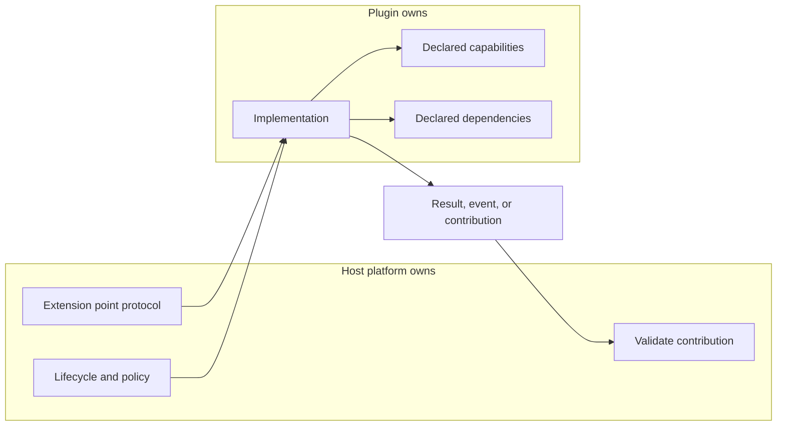

# Extension Points and Plugin Contracts: Theory

[Concept overview](README.md) · [Interview questions](interview.md)

## Mental Model

A plugin system separates a stable host from variable feature behavior. The host
publishes extension points. Plugins implement those contracts and are discovered,
registered, or composed by the host.

The contract is more important than the loading mechanism. In an iOS app, plugins
are often source modules, Swift packages, feature frameworks, or internally
registered capabilities rather than runtime-loaded binaries.

## Contract Shape

Good extension points are narrow. They expose the minimum context a plugin needs
to do its work and return a contribution that the host can validate.

| Contract part | What it answers |
|---|---|
| Capability | What behavior does this plugin provide? |
| Context | What host data is safe to expose? |
| Lifecycle | When is the plugin created, invoked, cancelled, and released? |
| Ordering | Can multiple plugins run, and who decides sequence? |
| Failure | Does one plugin failure stop the host operation? |
| Observability | How does the host attribute latency, errors, and adoption? |

Avoid extension points that pass a large service locator or mutable app state.
That makes every plugin a privileged peer of the host and prevents safe evolution.

## Engineering Decisions

Use plugins when variation is real and independently owned. Examples include
feature contributions to a home screen, checkout payment methods, analytics
destinations, rendering providers, policy validators, and SDK integrations.

Do not build a plugin system only to avoid choosing a simple dependency boundary.
The cost includes contracts, documentation, versioning, debugging, compatibility,
support, and governance.

Host-owned responsibilities should remain host-owned:

| Host owns | Plugin owns |
|---|---|
| Registration and discovery policy | Implementation behind the contract |
| Lifecycle and cancellation | Local validation and transformation |
| Security and permission checks | Declared capabilities and requirements |
| Ordering and aggregation | Plugin-specific configuration |
| Platform metrics and diagnostics | Plugin-specific metrics where useful |

## Production Application

Contract tests should verify that any plugin can be called with valid context,
handles cancellation, reports errors predictably, and does not require hidden host
state. Host tests should use fake plugins to verify ordering and failure policy.

For cross-team platforms, publish a compatibility matrix. It should state which
host versions support which plugin contract versions, which APIs are experimental,
and when old contracts are removed.

## References

- [Swift API Design Guidelines](https://www.swift.org/documentation/api-design-guidelines/)
- [Creating a Swift package](https://developer.apple.com/documentation/xcode/creating-a-swift-package)
