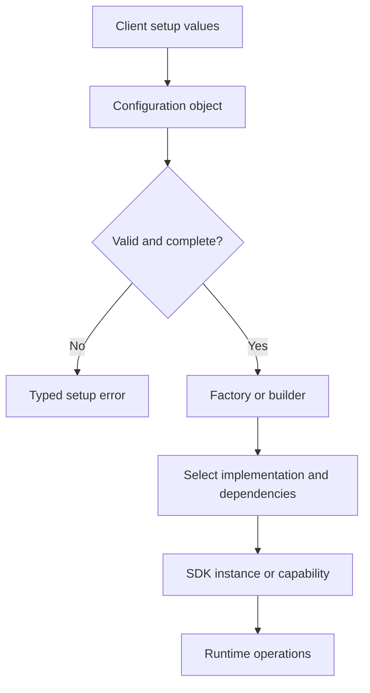

# Factories, Builders, and SDK Configuration: Theory

[Concept overview](README.md) · [Interview questions](interview.md)

## Mental Model

SDK construction is part of the public contract. Clients need a clear path from
configuration to a usable capability, and the SDK needs a place to validate
environment, credentials, feature flags, dependencies, and lifecycle policy.

Factories, builders, and configuration objects are useful when they encode real
setup rules. They become noise when they only wrap a simple initializer.

## Construction Flow

The boundary between setup and runtime should be explicit. Setup validates facts
that should not change during an SDK instance's lifetime. Runtime APIs perform
the actual capability work.

## Pattern Selection

| Pattern | Best use | Avoid when |
|---|---|---|
| Configuration object | Stable values such as API key, environment, app group, feature flags | Values must be changed frequently at runtime |
| Builder | Many optional setup choices, staged validation, readable client code | The SDK has two required parameters |
| Factory | Implementation selection, dependency assembly, test/prod variants | The factory merely calls one public initializer |
| Provider protocol | Client supplies behavior such as auth token, logger, clock, network transport | It exposes internal SDK service boundaries |

A good SDK may use more than one. For example, a client passes
`SDKConfiguration`, a builder attaches optional providers, and a factory creates
the concrete SDK implementation behind a public facade.

## Validation and Lifecycle

Fail early for invalid setup. A missing API key, unsupported environment, invalid
URL, unavailable entitlement, or incompatible option combination should be
reported before a feature call starts.

Separate these concerns:

| Concern | Construction owner |
|---|---|
| Required static values | Configuration initializer or builder validation |
| Optional customization | Builder methods with documented defaults |
| Implementation selection | Factory or composition root |
| Long-lived resources | SDK instance lifecycle |
| Per-request data | Runtime method input, not global configuration |

Do not store per-user or per-request data in global SDK configuration unless the
SDK instance is intentionally scoped to that user or request. Otherwise logout,
account switching, tests, and extensions become fragile.

## Engineering Decisions

For public SDKs, prefer immutable configuration after construction. Mutating setup
in place makes behavior hard to reason about and can race with in-flight work. If
the client must change environment or account, create a new SDK instance or expose
an explicit reconfiguration API with defined cancellation and migration behavior.

Provider injection should be narrow. A logging provider, token provider, or URL
session adapter can be useful. Passing an unrestricted service container gives
clients and SDK internals too much knowledge of each other.

At Principal scope, construction patterns also support compatibility. A builder
can add optional configuration without breaking source, and a factory can keep
implementation selection internal while the public facade stays stable.

## Production Application

Test invalid setup as carefully as successful setup. Client mistakes should
produce deterministic, actionable errors. Include diagnostics such as SDK version,
environment, enabled capabilities, and missing configuration keys, while avoiding
secrets in logs.

Sample apps should show the recommended construction path. If every integration
guide starts with several advanced providers, the SDK surface is probably too
complex for normal clients.

## References

- [Swift API Design Guidelines](https://www.swift.org/documentation/api-design-guidelines/)

