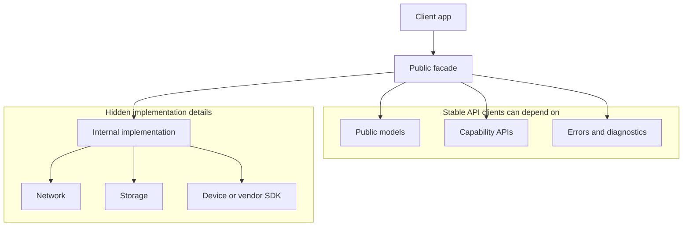
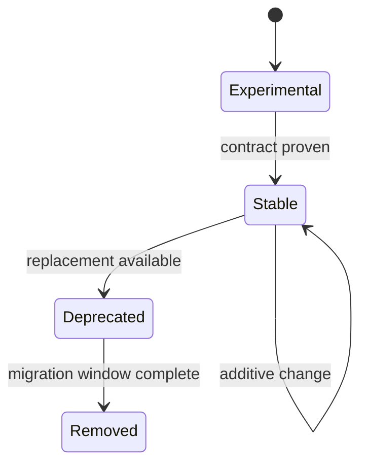

# SDK API Surface and Evolution: Theory

[Concept overview](README.md) · [Interview questions](interview.md)

## Mental Model

An SDK is architecture at an API boundary. Clients should understand the public
surface without learning the SDK's internal layering. The SDK should evolve
without forcing client rewrites for ordinary implementation changes.

Good SDK design starts from supported workflows:

```text
configure -> request capability -> observe result -> handle error -> diagnose
```

## API Surface



The public facade should describe what the client can do. It should not expose
transport objects, persistence entities, internal queues, or implementation
classes unless clients genuinely need that control.

| Surface area | Design question |
|---|---|
| Configuration | What must the client provide before use? |
| Capability API | What actions or streams does the SDK support? |
| Result model | What does success mean in client terms? |
| Error model | Which failures are recoverable, retryable, or developer mistakes? |
| Concurrency | Which actor or callback context delivers results? |
| Diagnostics | How can clients and SDK owners debug production issues? |

## Evolution

Stable SDKs prefer additive changes. Add new types, overloads, optional
capabilities, or defaulted behavior before changing existing contracts. When a
breaking change is necessary, provide a migration window and a reason that maps
to client value.



Versioning should reflect compatibility, but semantic version numbers alone do
not make an SDK safe. Clients also need release notes, migration examples,
deprecation annotations, and a way to test integration before rollout.

## Engineering Decisions

Prefer a small facade over exposing many low-level services. Internally, the SDK
can still use Clean Architecture, ports and adapters, repositories, actors, or
feature modules. Externally, clients should see a coherent product capability.

Use protocols for client-provided dependencies only when clients need to supply
behavior. Do not expose protocols merely because the SDK implementation uses
protocols internally.

For binary or package distribution, decide what is source-stable, binary-stable,
internal, experimental, and SPI. The team must know which promises are supported
before publishing APIs broadly.

## Production Application

SDKs need diagnostics by design. Include version, configuration state, capability
availability, request identifiers, error categories, and integration warnings.
Without this, every client failure becomes a support investigation.

Test the SDK like a client. Maintain sample apps, integration tests, API
compatibility checks, and migration tests. A unit test for the internal service is
not enough to prove the public API is usable.

## References

- [Swift API Design Guidelines](https://www.swift.org/documentation/api-design-guidelines/)
- [Creating a Swift package](https://developer.apple.com/documentation/xcode/creating-a-swift-package)
