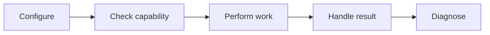
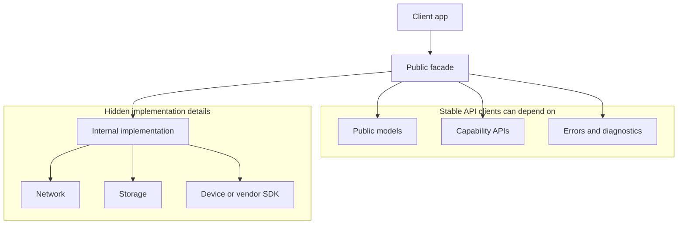
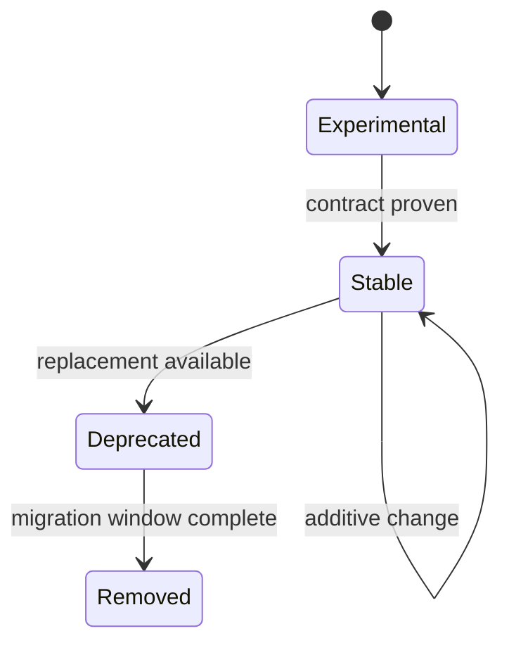

# SDK API Surface and Evolution: Theory

[Concept overview](README.md) · [Interview questions](interview.md)

## Mental Model

An SDK is a supported boundary between teams, releases, and sometimes organizations.
Clients should understand its workflows without learning its internal layers. The SDK
should change implementation freely while changing its published contract deliberately.

Good SDK design starts from supported workflows:

## API Surface

The facade describes client capabilities. Do not expose transport clients, persistence
entities, queues, concrete services, or vendor SDK types only because the implementation
uses them. Every public declaration becomes compatibility and support work.

| Surface area | Design question |
|---|---|
| Configuration | What must the client provide before use? |
| Capability API | What actions or streams does the SDK support? |
| Result model | What does success mean in client terms? |
| Error model | Which failures are recoverable, retryable, or developer mistakes? |
| Concurrency | Which actor owns calls and results, and how do cancellation and overlap work? |
| Diagnostics | How can clients and SDK owners debug production issues? |
| Data policy | What is collected, retained, redacted, and safe to log? |

Document behavior as carefully as signatures. Changing callback order, actor isolation,
error categories, retry policy, persistence, or data collection can break clients even
when source still compiles.

## Separate Compatibility Promises

- **Source compatibility:** existing client source still compiles.
- **Binary compatibility:** an already-built client can use a separately built library.
- **Behavior compatibility:** documented outcomes and timing rules remain valid.
- **Distribution compatibility:** the artifact supports the client's platforms,
  architectures, toolchain, and integration method.

For source packages built with their clients, focus on public source and behavior. For a
binary Swift framework distributed separately, decide module stability and library
evolution before the first supported release. Swift's library-evolution mode is intended
for libraries updated separately from clients; it changes layout and evolution rules and
has performance costs. It is not a default setting for every internal package.

## Evolve the Contract

Stable SDKs prefer additive changes. Add new types, overloads, optional
capabilities, or defaulted behavior before changing existing contracts. When a
breaking change is necessary, provide a migration window and a reason that maps
to client value.

Prefer additive evolution, but verify that an addition is safe for the actual contract.
For example, adding an enum case can affect exhaustive client switches, and changing a
default argument may leave already-compiled callers using the old value. Semantic version
numbers describe intent; they do not create source, binary, or behavior compatibility.

A deprecation needs a supported replacement, migration notes, an observation window, and
a stated removal policy. For a costly migration, add an adapter or compatibility layer and
measure supported-version use before removal.

## Engineering Decisions

Use protocols when clients need to supply behavior, such as authentication or logging.
Do not publish internal abstraction protocols as customization points. Keep experimental
API clearly outside the stable promise, and avoid informal SPI that clients will treat as
public once it solves a real need.

Choose source distribution when transparency, portability, and client compilation are
acceptable. Binary XCFramework distribution can protect implementation and reduce source
exposure, but it limits supported platforms to the included variants and adds artifact,
toolchain, symbol, and compatibility work.

## Benefits and Costs

| Benefits | Costs and risks |
|---|---|
| A small facade hides internal replacement | Every public type limits future change |
| Stable workflows reduce client integration cost | Compatibility tests multiply across supported versions |
| Additive APIs allow gradual client migration | Old paths increase implementation and support load |
| Binary distribution can hide implementation | Artifacts, symbols, platforms, and toolchains need support |

## Production Application

Expose version, configuration validation, capability availability, request identifiers,
stable error categories, and redacted logging hooks. Do not require access to internal
logs to diagnose an ordinary integration failure.

Test through the public product in a sample app. Compile representative clients against
the current and previous supported releases. Add migration and binary checks when those
promises apply. Internal unit tests cannot prove that packaging, documentation,
concurrency behavior, or the public workflow works for a client.

## References

- [Swift API Design Guidelines](https://www.swift.org/documentation/api-design-guidelines/)
- [Library Evolution in Swift](https://www.swift.org/blog/library-evolution/)
- [Distributing binary frameworks as Swift packages](https://developer.apple.com/documentation/xcode/distributing-binary-frameworks-as-swift-packages)
