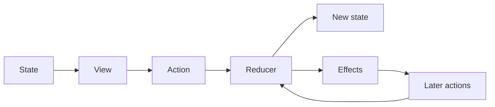

# State, Actions, and Reducers: Theory

[Concept overview](README.md) · [Interview questions](interview.md)

## Mental Model

Unidirectional Data Flow (UDF) makes change follow one loop:



The view reads state and sends an action. The reducer handles that action, changes
state synchronously, and may describe external work. Effect results return as new
actions rather than mutating state from a second path.

This provides one place to answer: "How could the feature reach this state?"

## Model State for Behavior

State is the minimum set of facts needed to render and continue the feature. Prefer
valid combinations over unrelated flags:

```swift
struct SearchState: Equatable {
    enum Results: Equatable {
        case idle
        case loading
        case loaded([Row])
        case failed(message: String)
    }

    var query = ""
    var results: Results = .idle
}
```

Store facts once. `canSearch` can derive from `query`; a result count can derive from
rows. A cached derivation needs a measured reason and an invalidation rule.

Not every UI value belongs in the feature store. Focus, animation progress, and a
temporary disclosure can remain local when no other behavior depends on them. Moving
all visual state into one global store increases action traffic and coupling.

## Design Actions as Events or Intent

Actions form the feature's event vocabulary:

```swift
enum SearchAction: Equatable {
    case queryChanged(String)
    case searchTapped
    case response(Result<[Row], SearchFailure>)
    case cancelTapped
}
```

User actions describe intent. System and effect actions describe outcomes. Keep them
specific enough to reveal behavior but do not create an action for every private
assignment solely to satisfy ceremony.

Actions should be values. A closure, service, or mutable object inside an action hides
behavior and weakens equality, logging, persistence, and tests. Sensitive data may
need redaction, and large payloads may need summarized logging.

## Keep Reducer Work Synchronous

A reducer applies one action to current state and returns effect descriptions:

```swift
struct SearchReducer {
    mutating func reduce(
        state: inout SearchState,
        action: SearchAction
    ) -> [SearchEffect] {
        switch action {
        case let .queryChanged(query):
            state.query = query
            return [.cancelSearch]

        case .searchTapped:
            guard !state.query.isEmpty else { return [] }
            state.results = .loading
            return [.search(query: state.query)]

        case let .response(.success(rows)):
            state.results = .loaded(rows)
            return []

        case let .response(.failure(error)):
            state.results = .failed(message: error.message)
            return []

        case .cancelTapped:
            state.results = .idle
            return [.cancelSearch]
        }
    }
}
```

The exact API varies by framework. The architectural rule is stable: reducers do not
start invisible tasks, read global time, or call random generators directly. They
describe work through dependencies or effect values so the same input can be tested.

"Pure reducer" usually means no hidden external interaction. In-place mutation of a
local `inout` state can still be deterministic and efficient.

## Define Store Responsibilities

A store normally owns current state, serial action processing, reducer execution,
effect startup, and observation. It must define what happens when an effect emits an
action: that action returns to the same serialized loop.

Do not allow an effect callback to mutate store state directly. That creates a second
write path and makes ordering dependent on callback timing. Also prevent synchronous
recursive dispatch from producing an unbounded call stack; process actions through a
queue or runtime with documented ordering.

## Pros and Cons

| Benefits | Costs and risks |
|---|---|
| Every state change has an action trail | More types and event vocabulary |
| Reducer transitions are fast to test | Simple edits may require ceremony |
| Effects have an explicit return path | Large state or action enums can become coupled |
| State machines expose invalid combinations | Poor scoping can update too much UI |
| Replay and diagnostics become possible | Logs can expose sensitive data or become noisy |

UDF fits features with several transitions, concurrent effects, shared state, or a
need for strong diagnostics. A direct observable model is often clearer for a small
form or isolated screen with few effects.

## Engineering Decisions

Test reducers as transition tables: given state and action, assert next state and
effects. Include invalid or repeated actions, not only happy paths. Store integration
tests cover effect execution and ordering.

At Staff scope, standardize action naming, effect boundaries, redaction, and module
composition. Avoid a single application reducer that forces unrelated teams to share
one release surface. Define when teams may use a simpler state model.

## References

- [Redux Fundamentals: Concepts and Data Flow](https://redux.js.org/tutorials/fundamentals/part-2-concepts-data-flow)
- [Redux Fundamentals: State, Actions, and Reducers](https://redux.js.org/tutorials/fundamentals/part-3-state-actions-reducers)
- [Managing model data in your app](https://developer.apple.com/documentation/swiftui/managing-model-data-in-your-app)
