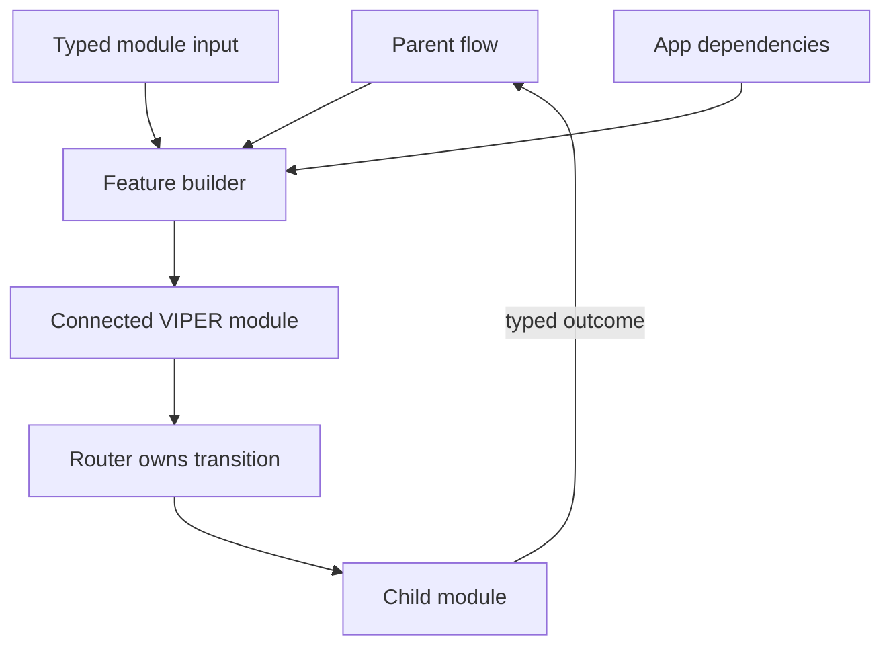

# Module Assembly, Routing, and Data Handoff: Theory

[Concept overview](README.md) · [Interview questions](interview.md)

## Mental Model

A VIPER module needs an external composition point. The builder creates the view,
presenter, interactor, and router, injects shared dependencies, and returns one supported
entry point. The router performs navigation without becoming a service locator.

Construction dependencies flow inward. User outcomes flow back through a narrow module
contract rather than hidden globals.

## Assemble Once

The builder should validate required dependencies and connect the graph in one place. It
can return a `UIViewController`, a feature input interface, or both in a small module
handle. Callers should not know how many VIPER objects exist.

Avoid letting the presenter construct its interactor or router. That hides dependencies,
makes substitution harder, and mixes runtime behavior with graph creation. Shared clients
come from the application composition root; feature-specific objects are created by the
feature builder.

Weak references may be needed on output links to avoid cycles, but memory ownership
should follow navigation ownership. The parent or router retains the active child module
for as long as the child flow exists, then releases it on dismissal or completion.

## Route Intent and Mechanics

The presenter knows when feature state requires a route. The router knows how the iOS
transition works. A route API should use domain or presentation values, not pass arbitrary
view controllers and mutable dictionaries through the app.

Keep cross-feature policy at the parent flow when several modules participate. If every
VIPER router directly knows every other module, navigation becomes a mesh. A coordinator
or application router can own larger journeys while local routers handle feature-specific
transitions.

## Data Handoff

Pass required immutable input at construction. Examples include an entity ID, mode, or
permission set. Fetching everything from a global session makes module requirements
invisible and complicates tests.

Return outcomes through one explicit contract:

- a weak module delegate for multiple lifecycle events;
- a closure for one small completion result;
- an async result when the parent naturally awaits a bounded child operation;
- shared domain state only when that state has a real owner beyond both modules.

Do not pass mutable domain objects for two modules to edit independently. Pass identity
and reload from an owner, or pass an immutable snapshot and return an explicit change.

Deep links should enter through the flow owner, which builds the required module chain
and validates input. A leaf router should not recreate application-level state privately.

## Benefits and Costs

| Benefits | Costs and risks |
|---|---|
| Central assembly makes dependencies visible | Manual wiring is verbose and can be wrong |
| Typed input and output clarify module contracts | Many small protocols add maintenance |
| Router isolates UIKit transition mechanics | Routing ownership can overlap with coordinators |
| Parent-controlled lifetime supports cleanup | Weak/strong reference mistakes can leak or deallocate modules |

Use code generation only for repetitive safe wiring, not to hide the object graph. The
generated output should remain understandable when navigation or retention fails.

## References

- [objc.io: Architecting iOS Apps with VIPER](https://www.objc.io/issues/13-architecture/viper/)
- [Apple: View Controller Programming Guide — Presentations and Transitions](https://developer.apple.com/library/archive/featuredarticles/ViewControllerPGforiPhoneOS/PresentingaViewController.html)
