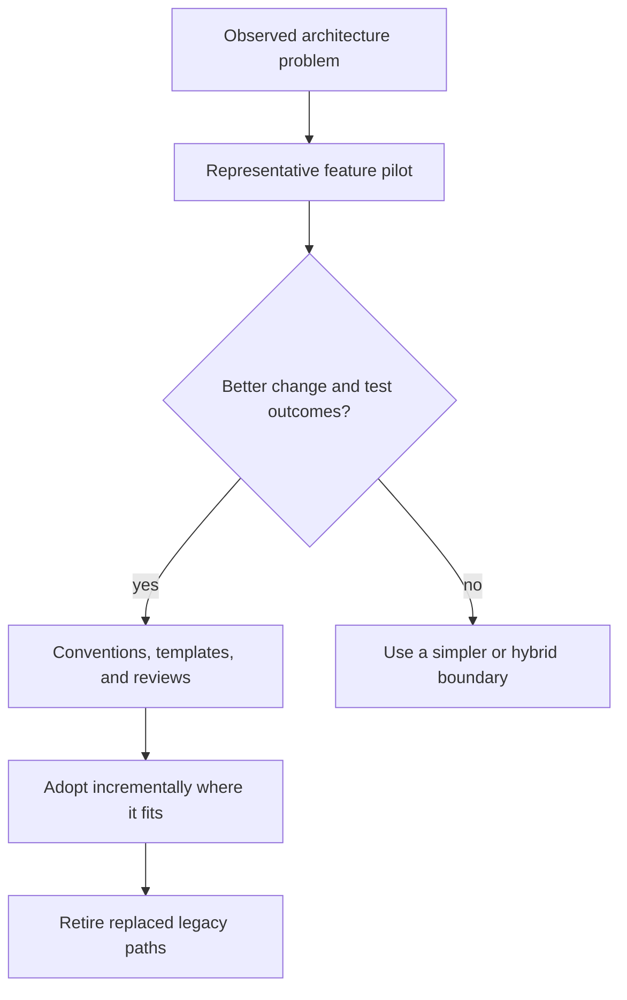

# Testability, Complexity, and Adoption: Theory

[Concept overview](README.md) · [Interview questions](interview.md)

## Mental Model

VIPER exchanges local simplicity for isolated responsibilities. That trade can help when
presentation, use cases, and navigation change independently. It can hurt when every user
action crosses several pass-through objects that have no independent policy.

Evaluate the pattern through behavior, team boundaries, and change cost rather than test
coverage or file count alone.

The pilot should test the hard parts: async state, navigation, data handoff, and team
ownership. A static sample screen proves little.

## Test at Responsibility Boundaries

Presenter tests drive user events or interactor outputs and assert rendered state or
route intent. Interactor tests provide fake repositories and verify domain outcomes.
Router tests verify destination selection and handoff; a small integration test checks
actual UIKit wiring. Assembly tests catch missing or incorrect connections.

Avoid tests that assert every internal call. They make harmless refactoring expensive and
can pass while user-visible behavior is wrong. Test the contract each role owns.

Protocols help at real substitution boundaries. A protocol for every class can create
mock-heavy tests that mirror implementation rather than behavior. Use concrete values and
small fakes where they are simpler.

## Recognize Complexity Signals

VIPER is becoming ceremony when:

- presenter and interactor only forward the same method names;
- entities are duplicated display structs with no boundary reason;
- every feature invents different output and routing conventions;
- tracing one state change requires many mocks and callbacks;
- builders or generators hide retention and lifecycle;
- simple changes require edits in every role.

Combine roles when their reasons to change are not independent. A small feature may use a
view plus one state owner and a coordinator. Preserve use-case and navigation boundaries
where they provide value without enforcing the full acronym.

## Adoption Decision

| VIPER fits better when | Prefer a simpler approach when |
|---|---|
| Existing team and tooling already support it | Team would learn it for one small feature |
| UIKit feature has complex presentation and routes | SwiftUI state flow is direct and local |
| Roles change independently across a large team | Same developer changes all roles together |
| Strict module interfaces support ownership | Protocol and wiring cost exceeds isolation benefit |

For an existing app, pilot VIPER on a new or heavily changing feature behind a stable
entry point. Do not rewrite stable screens for naming consistency. Compare defect rate,
change lead time, onboarding, review clarity, and test maintenance with the current
approach.

Standardize only after evidence. Templates can reduce boilerplate, but they should encode
approved ownership, concurrency, routing, and cleanup rules. Generated volume is still
architecture that the team must maintain.

## Benefits and Costs

| Benefits | Costs and risks |
|---|---|
| Focused presenter and interactor tests | Mock and protocol maintenance |
| Clear navigation and use-case roles | High object and wiring count |
| Feature modules can support team ownership | Indirection slows tracing and onboarding |
| Incremental feature adoption is possible | Mixed architectures need explicit integration seams |

At Staff scope, choose proportionate boundaries and prevent pattern drift. The strongest
answer is often a hybrid: keep explicit use cases and flow ownership while using a simpler
presentation model where full VIPER separation adds no value.

## References

- [objc.io: Architecting iOS Apps with VIPER](https://www.objc.io/issues/13-architecture/viper/)
- [Swift API Design Guidelines](https://www.swift.org/documentation/api-design-guidelines/)
