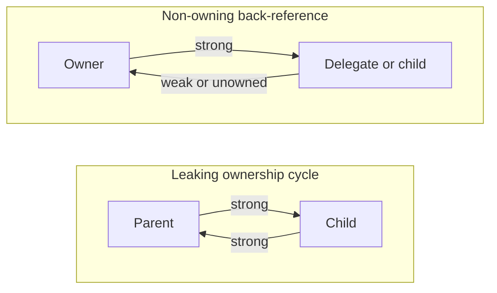

# Object Graph Cycles and Non-Owning References: Theory

[Concept overview](README.md) · [Interview questions](interview.md)

## Mental Model

Each reference in an object graph answers one question: does this object own the
referenced object's lifetime? A strong reference means yes. A weak reference means
no, and the referenced object may disappear. An unowned reference also means no,
but the referenced object must still exist whenever code uses the reference. A
cycle is a design error when every object in it claims to own another.

## How It Works



```swift
final class Parent {
    let name: String
    var children: [Child] = []

    init(name: String) { self.name = name }
}

final class Child {
    let name: String
    unowned let parent: Parent

    init(name: String, parent: Parent) {
        self.name = name
        self.parent = parent
    }
}
```

The parent strongly owns children. A child has a mandatory back-reference but does not own the
parent. This is correct only if no child can outlive its parent. If children can escape or outlive
the relationship, use `weak var parent: Parent?` and define behavior for absence.

Cycles can span many nodes through collections, delegates, timers, observation tokens, caches,
and closures. Fix the ownership model or explicitly tear down registrations; changing an arbitrary
edge to weak can turn a leak into missing required work.

### Rules That Must Stay True

- Each non-owning edge corresponds to a documented domain lifetime relationship.
- Weak disappearance has defined behavior rather than an accidental silent no-op.
- Before every unowned access, the program's structure must guarantee that the owner is still alive.
- Escaping children, tokens, and callbacks cannot invalidate unowned assumptions.
- The code that breaks a cycle has a clear owner and is safe to call more than once.

### Constraints and Guarantees

- Weak references apply to class instances and do not keep them alive.
- A weak binding can be `let` when it is never explicitly reassigned or `var` when the program changes it; ARC zeroing still occurs.
- Loading and unwrapping a weak reference can create a strong reference for the resulting scope.
- Weak zeroing does not synchronize the referenced object's mutable state.
- Safe unowned references perform a lifetime check on access; unsafe unowned removes that safety.
- ARC does not search for or collect strongly connected unreachable cycles.

## Engineering Judgment

### When to Use It

Use weak for observers, delegates, and back-references where independent disappearance is valid.
Use unowned only for a required relationship where the API or type structure
prevents the referenced owner from dying first.

### When Not to Use It

Do not use unowned based on expected timing, and do not use weak for dependencies whose availability
is required. Give required work a strong operation owner and explicit cancellation instead.

### Trade-offs

| Edge | Retains | Absence model | Failure mode | Best fit |
|---|---:|---|---|---|
| Strong | Yes | Not applicable | Cycle/extended lifetime | Owned dependency |
| Weak | No | Optional, zeroed | Work disappears if ignored | Independent observer/back-reference |
| Unowned | No | Assumed present | Trap after deallocation | Proven owner-owned child |
| Unowned unsafe | No | Unchecked | Dangling-memory behavior | Rare low-level interop with separate proof |

## Production Application

### Performance

Choose lifetime behavior first. Weak and unowned operations have different runtime bookkeeping, but incorrect
lifetime policy costs more than a micro-optimization. Profile only after graph correctness.

### Concurrency and Thread Safety

A weak load can become `nil` between operations unless unwrapped into a strong local. That local
extends lifetime but does not isolate state. Access the object through its required actor or lock.

### Testing

Test both sides of every non-owning contract: owner survives normal work, owner disappears early,
child/token escapes, teardown repeats, and callbacks race with cancellation. Use weak probes for leaks.

### Observability and Debugging

Inspect paths from roots, not only cycles. Label registrations and tokens with owner IDs, and distinguish
expected long lifetime from unreachable leaked lifetime in memory graphs.

### Compatibility and Migration

Changing edge strength affects lifetime and behavior without changing most call sites. Roll out with
early-release assertions, cancellation metrics, leak tests, and a fallback ownership path.

## Staff and Principal Perspective

Cross-module object graphs need explicit ownership conventions. Frameworks should document delegate,
token, child, cache, and callback retention so clients do not reverse-engineer lifecycle from leaks.

## References

- [The Swift Programming Language: Automatic Reference Counting](https://docs.swift.org/swift-book/documentation/the-swift-programming-language/automaticreferencecounting/)
- [Swift Compiler Diagnostic: Weak Mutability](https://docs.swift.org/compiler/documentation/diagnostics/weak-mutability/)
