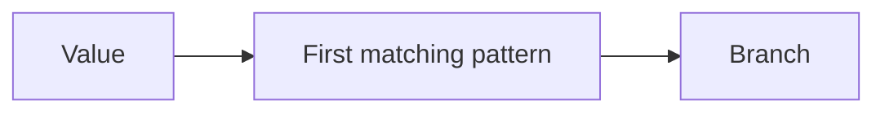

# Conditional Branching and Pattern Matching: Theory

[Concept overview](README.md) · [Interview questions](interview.md)

## Mental Model

An `if` chooses a branch from Boolean conditions. A `switch` divides all possible
values into branches using patterns checked in order:



An exhaustive switch handles every possible input. When more than one pattern
could match, the first matching case wins.

## How It Works

### if Statements and Expressions

Use `if` when conditions are direct and branch count is small:

```swift
if response.isFresh && !response.items.isEmpty {
    render(response.items)
} else {
    renderPlaceholder()
}
```

An `if` expression produces a value without mutable temporary state:

```swift
let destination: Destination = if isAuthenticated {
    .account
} else {
    .signIn
}
```

Every path must produce a value, so an expression-form `if` requires `else`.
Branches are type-checked individually and need a common result type. Ambiguous
`nil` literals often need explicit optional context:

```swift
let warning: String? = if temperature <= 0 {
    "Ice risk"
} else {
    nil
}
```

Expression branches are intentionally constrained. If a branch needs substantial
logging, mutation, or several steps, use a statement that assigns every path or
an extracted function is usually clearer.

### Exhaustive switch

A switch must cover every possible value. Known finite enums can often be listed
without `default`, which lets the compiler identify missing cases when the model
changes:

```swift
enum LoadState {
    case idle
    case loading
    case loaded([Item])
    case failed(Error)
}

let presentation = switch state {
case .idle: Presentation.placeholder
case .loading: .spinner
case .loaded(let items): .content(items)
case .failed(let error): .failure(error)
}
```

For open-ended values such as integers or strings, a `default` or another
catch-all pattern completes coverage. A default is not automatically good API
design: it may discard the distinction between unexpected, invalid, and newly
introduced states.

### First Match Wins

Swift uses the first matching case. Overlapping patterns therefore require
specific-to-general ordering:

```swift
switch statusCode {
case 200:
    handleSuccess()
case 200..<300:
    handleOtherSuccess()
default:
    handleFailure()
}
```

Reversing the first two cases means the exact case can never run. The
compiler can diagnose some unreachable patterns, but reviewers should treat case
order as part of the decision.

### Pattern Forms and Bindings

Switch patterns can combine structure and data extraction:

```swift
switch event {
case .response(status: 200, payload: let data) where !data.isEmpty:
    consume(data)
case .response(status: 400..<500, payload: _):
    reportClientError()
case .failure(let error as URLError):
    handleNetwork(error)
case .failure(let error):
    handleOther(error)
}
```

Common tools include:

- literal and enum-case patterns for exact states;
- interval patterns for numeric regions;
- tuple patterns for several dimensions;
- wildcard `_` to ignore a component;
- value bindings with `let` or `var`;
- type-casting patterns with `is` and `as`;
- `where` clauses for predicates after successful structural matching;
- compound cases separated by commas when they share one body and compatible
  bindings.

Bindings are scoped to the matched branch. Compound patterns must bind the same
names with compatible types so the shared body is well-defined.

### if case, guard case, and for case

Use pattern conditions when one structural case matters:

```swift
if case .loaded(let items) = state {
    render(items)
}

for case .success(let value) in results {
    consume(value)
}
```

These forms intentionally ignore nonmatches. Use switch when every case needs an
explicit decision, metrics, or error path. `guard case` applies the same matching
model while requiring the nonmatching branch to exit the enclosing scope.

### Statement versus Expression Form

Choose expression form when each branch naturally yields one value and the
complete decision is easy to scan. Choose statement form when branches perform
effects, need several operations, or have different control transfers.

An expression can throw or terminate on a branch that cannot produce a value.
Do not hide broad side effects inside value construction merely to avoid a local
variable.

### Enums That May Gain New Cases

For enums whose cases are under the same module's control, spelling every case
lets the compiler find code that needs updating when the enum changes. A
nonfrozen enum from another module may gain cases in a future version.
`@unknown default` handles runtime-unknown
cases while asking the compiler to warn when currently known cases are omitted.

The fallback still needs a product policy: preserve data, disable a feature,
surface an unsupported state, or fail safely. Logging and telemetry should use a
form that does not expose private data. It should also avoid repeated crashes when
a newer producer sends an unknown case.

### Rules That Must Stay True

- Every switch input matches at least one case.
- Exactly the first matching case executes unless explicit `fallthrough` changes
  control.
- Overlap precedence is intentional and reviewed.
- Bindings exist only after their pattern succeeds.
- Expression branches produce compatible values or do not return.
- Unknown-state handling matches whether future versions may add cases.

### Constraints and Guarantees

- Swift switch has no implicit fallthrough.
- `default` ensures coverage but suppresses compiler pressure to name known cases.
- `where` refines a matched pattern; it does not make a nonexhaustive switch
  exhaustive.
- Pattern matching does not validate domain rules that the pattern does
  not express.
- `if case` and `for case` discard nonmatching values by design.

## Engineering Judgment

### Decision Criteria

| Situation | Prefer | Reason |
|---|---|---|
| One or two independent predicates | `if` | Direct Boolean intent |
| Closed enum state machine | Exhaustive `switch` | Compiler-checked coverage |
| Structured extraction for one case | `if case` or `guard case` | Concise pattern binding |
| Filter matching sequence elements | `for case` | Pattern-driven iteration |
| Map states to one result | `if`/`switch` expression | Immutable result construction |
| Effects or multi-step branches | Statement form or extracted handlers | Clear ownership and tests |

### Trade-offs

Exhaustive switches intentionally require more work when the model changes: every
consumer must consider a new case. Defaults reduce code changes but can hide new
states. Cases with many nested patterns are compact, but may be harder to read and
measure than extracting values first and making simpler decisions afterward.

## References

- [The Swift Programming Language: Conditional Statements](https://docs.swift.org/swift-book/documentation/the-swift-programming-language/controlflow/#Conditional-Statements)
- [The Swift Programming Language: Patterns](https://docs.swift.org/swift-book/documentation/the-swift-programming-language/controlflow/#Patterns)
- [The Swift Programming Language: Patterns Reference](https://docs.swift.org/swift-book/documentation/the-swift-programming-language/patterns/)
- [SE-0380: `if` and `switch` Expressions](https://github.com/swiftlang/swift-evolution/blob/main/proposals/0380-if-switch-expressions.md)
- [SE-0192: Handling Future Enum Cases](https://github.com/swiftlang/swift-evolution/blob/main/proposals/0192-non-exhaustive-enums.md)
