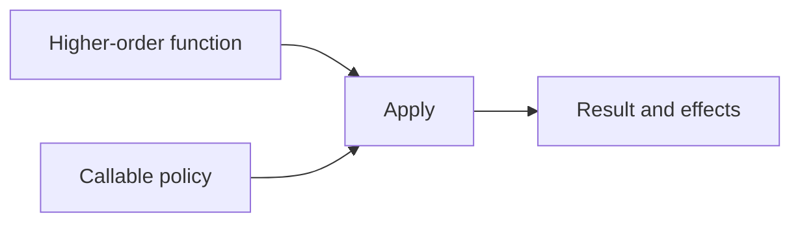

# Function Values and Higher-Order Functions: Theory

[Concept overview](README.md) · [Interview questions](interview.md)

## Mental Model

A function value is callable behavior stored in a value. A *higher-order
function* accepts a function, returns a function, or does both. This separates
stable control flow from caller-supplied behavior:



The arrow type is necessary but incomplete. A production callback contract also
defines its lifetime, number of calls, executor or actor, ordering, reentrancy, error,
cancellation, and ownership.

## How It Works

### Function Types

Every function type has parameter types and a result:

```swift
func isAscending(_ lhs: Int, _ rhs: Int) -> Bool {
    lhs < rhs
}

let ordering: (Int, Int) -> Bool = isAscending
let comesFirst = ordering(2, 5) // true
```

The value `ordering` stores callable behavior. It can be invoked, assigned to
another compatible function variable, or passed as an argument.

Argument labels belong to the declaration's call spelling, not to the stored
function type. Once converted to `(Item, Item) -> Bool`, the value is invoked by
position.

Effect markers limit which functions can be used in its place. A synchronous nonthrowing function can be
used where fewer effects are acceptable, while callers of throwing or async
values must handle those effects. Actor isolation and `@Sendable` can
also be part of modern concurrency-facing function contracts.

### Passing Functions as Parameters

Higher-order APIs accept caller-provided behavior:

```swift
func transform(_ value: Int, using operation: (Int) -> Int) -> Int {
    operation(value)
}

func doubled(_ value: Int) -> Int {
    value * 2
}

let result = transform(4, using: doubled) // 8
```

`transform` owns when the operation is called. Its caller chooses what operation
to supply. Standard functions such as `map`, `filter`, and `sorted(by:)` use the
same idea.

The pattern also works with generics and throwing functions:

```swift
func firstMatch<S: Sequence>(
    in values: S,
    where predicate: (S.Element) throws -> Bool
) rethrows -> S.Element? {
    for value in values where try predicate(value) {
        return value
    }
    return nil
}
```

The higher-order function owns traversal and short-circuiting; the caller owns the
predicate. `rethrows` communicates that this function throws only when the
provided operation throws. Detailed error design belongs to error handling, but
the effect remains part of the higher-order API.

Use a function parameter for one focused customizable operation. Use a protocol or
concrete collaborator when behavior has several related operations, long-lived
identity, configuration, state, lifecycle, or mocking requirements.

### Returning Functions

A function can choose or construct behavior:

```swift
func comparator(ascending: Bool) -> (Int, Int) -> Bool {
    if ascending {
        return { $0 < $1 }
    } else {
        return { $0 > $1 }
    }
}
```

Returned global functions carry no local capture context. Returned nested
functions or closures can retain captured state beyond the creating call. That
lifetime is observable through memory, ownership, and concurrency even when the
arrow type looks simple.

Prefer a named strategy type when the returned behavior needs inspection,
configuration, equality, serialization, multiple operations, or explicit
ownership.

### Key Paths as Property-Access Values

A key path is a typed value that selects a property:

```swift
struct User {
    let displayName: String
}

let users = [User(displayName: "Ana"), User(displayName: "Sam")]
let names = users.map(\.displayName)
// ["Ana", "Sam"]
```

Use it to select properties, provide sorting inputs, support dynamic member access, or build APIs that need
to name a property. Use a closure for control flow, validation, I/O, errors, or
async work. Writable key paths still follow normal exclusivity, actor isolation,
and access-control rules.

### Nonescaping and Escaping Parameters

Closure-valued parameters are nonescaping by default: the callee must finish using
them before it returns. This gives callers and the compiler a bounded lifetime.

```swift
var jobs: [() -> Void] = []

func enqueue(_ job: @escaping () -> Void) {
    jobs.append(job)
}
```

`@escaping` is required because `job` is stored for later. Escaping changes more
than syntax:

- captured values can remain alive after the call;
- mutable captures may be shared across later invocations;
- the callback can participate in ownership cycles;
- cancellation and unregister behavior need explicit policy.

Do not mark every callback escaping “just in case.” Preserve the stronger
nonescaping contract when invocation is synchronous and bounded.

### Execution Contract Beyond the Type

For each callback, document or encode:

- whether invocation is synchronous, deferred, or either;
- zero, one, or many calls;
- ordering relative to other events;
- actor, executor, or thread requirements;
- whether reentrant calls are possible;
- how cancellation prevents future calls;
- how errors and partial results are delivered;
- who owns registration and release.

“Completion handler” is not a complete contract. An API that sometimes calls
synchronously and sometimes later can create reentrancy bugs even when its
function type remains unchanged.

### @Sendable Function Values

`@Sendable` marks a function value safe to transfer across concurrency domains and
enables compiler checks on its captures:

```swift
func schedule(_ operation: @escaping @Sendable () async -> Void)
```

Captured values must satisfy sendability rules, and mutation of captured local
state is restricted. This does not guarantee the operation runs concurrently,
select an executor, serialize invocations, or make referenced global state safe.
Those properties require actor isolation, synchronization, and scheduler policy.

Use a global-actor-qualified function type when execution isolation is part of the
contract, such as UI behavior that must run on the main actor.

### Function Identity and Registration

Swift function values do not provide general `Equatable` or `Hashable` semantics.
Even apparently identical closures may have different capture contexts, and
compiler transformations make code-address identity unsuitable as domain state.

Return a stable token from registration:

```swift
let token = events.observe(handler)
events.removeObserver(token)
```

Alternatively, return a cancellation object that owns deregistration. Do not ask
callers to pass “the same closure” back to remove it.

### Type Aliases and Semantic Wrappers

A type alias can improve readability:

```swift
typealias Completion = @Sendable (Result<Payload, Error>) -> Void
```

It does not create a distinct type or add required rules. If two callbacks have the
same arrow shape but different meanings, labels, wrapper structs, or protocol
methods can prevent accidental interchange and provide documentation.

### Rules That Must Stay True

- Every supplied function is type-compatible with required inputs, output, and
  effects.
- Escaping lifetime is declared and owned.
- Invocation count, ordering, isolation, and cancellation are defined.
- Captured state outlives every valid invocation and remains concurrency-safe.
- Registration has an explicit stable removal mechanism.
- A higher-order API does not hide important differences in domain behavior.

### Constraints and Guarantees

- Matching function types do not prove that two functions mean the same thing.
- Nonescaping parameters cannot be stored for later ordinary use.
- `@escaping` says the call may outlive the function; it says nothing about when
  or how often invocation occurs.
- `@Sendable` is a transfer and capture-checking contract, not a scheduler or lock.
- Type aliases do not create nominally distinct callback types.
- Function values do not expose stable equality or persistence identity.
- Key paths do not bypass access control, exclusivity, actor isolation, or API ownership.

## Engineering Judgment

### Function Value versus Protocol

| Need | Prefer |
|---|---|
| One stateless operation | Function value |
| Several cohesive operations | Protocol or concrete type |
| Durable configuration or state | Named strategy type |
| Stable identity or registration | Token/owner type |
| Simple test seam | Function value or small protocol |
| Cross-actor operation | `@Sendable` and explicit isolation |
| Property projection | Key path |

### Trade-offs

Function values are lightweight and easy to combine but reveal little about their
meaning. Protocols and types add declarations while supporting lifecycle, identity,
capabilities, and documentation. Escaping increases flexibility at ownership and
concurrency cost. Sendable annotations improve enforcement but can expose legacy
non-Sendable dependencies requiring architectural work.

## References

- [The Swift Programming Language: Function Types](https://docs.swift.org/swift-book/documentation/the-swift-programming-language/functions/#Function-Types)
- [The Swift Programming Language: Key-Path Expression](https://docs.swift.org/swift-book/documentation/the-swift-programming-language/expressions/#Key-Path-Expression)
- [The Swift Programming Language: Closures](https://docs.swift.org/swift-book/documentation/the-swift-programming-language/closures/)
- [SE-0103: Make Nonescaping Closures the Default](https://github.com/swiftlang/swift-evolution/blob/main/proposals/0103-make-noescape-default.md)
- [SE-0302: Sendable and @Sendable Closures](https://github.com/swiftlang/swift-evolution/blob/main/proposals/0302-concurrent-value-and-concurrent-closures.md)
