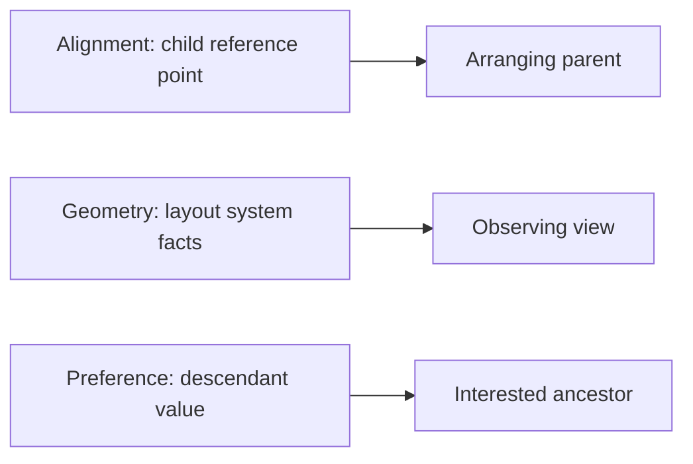

# Alignment, Geometry, and Preferences: Theory

[Concept overview](README.md) · [Interview questions](interview.md)

## Mental Model

These APIs solve three different layout communication problems:

- **Alignment** gives a parent a reference point for placing a child.
- **Geometry** describes a view's size or position in a coordinate space.
- A **preference** lets descendants report values that an ancestor can combine and read.



They should support layout, not become a parallel state architecture. Use built-in
containers first. Add measurement or upward communication only when the relationship
cannot be expressed directly.

## Alignment Guides

An alignment is a reference coordinate that a container uses while placing children.
For example, a leading-aligned `VStack` places children so their leading guides share
one horizontal coordinate. Text baseline alignments let an `HStack` align typography
rather than rectangles.

The `alignmentGuide` modifier supplies a different reference value for one child. Its
closure receives `ViewDimensions`, which exposes the child's measured dimensions and
default guides:

```swift
HStack(alignment: .firstTextBaseline) {
    Image(systemName: "person.crop.circle")
        .alignmentGuide(.firstTextBaseline) { dimensions in
            dimensions[VerticalAlignment.center]
        }

    Text(user.displayName)
}
```

The returned value is a coordinate in the child's layout dimensions. The parent moves
the child so that this coordinate aligns with the corresponding coordinates of its
siblings. Treating the number as an offset often reverses the intended direction and
makes the code difficult to reason about.

Custom alignments coordinate a semantic landmark that built-in guides do not model.
Define an `AlignmentID`, provide its default value, then create a `HorizontalAlignment`
or `VerticalAlignment`. Descendants can expose an explicit guide that a suitable
ancestor container uses. This can align a label or control across nested subviews
without measuring global frames.

This example creates a vertical guide for a title's first text baseline. A view that
does not supply the guide falls back to its bottom edge:

```swift
private struct TitleBaseline: AlignmentID {
    static func defaultValue(in dimensions: ViewDimensions) -> CGFloat {
        dimensions[VerticalAlignment.bottom]
    }
}

extension VerticalAlignment {
    static let titleBaseline = VerticalAlignment(TitleBaseline.self)
}

HStack(alignment: .titleBaseline) {
    VStack {
        Image("album-cover")
        Text("Album")
            .alignmentGuide(.titleBaseline) { dimensions in
                dimensions[.firstTextBaseline]
            }
    }

    Text("Now Playing")
        .alignmentGuide(.titleBaseline) { dimensions in
            dimensions[.firstTextBaseline]
        }
}
```

The enclosing `HStack` must use the custom alignment. SwiftUI can pass an explicit
guide through nested containers, which is why the two `Text` views can align even
though one is inside a `VStack`. `defaultValue(in:)` handles descendants that do not
set an explicit value.

Use a custom alignment when the requirement is “these landmarks line up.” Use a custom
layout when the parent needs a broader placement algorithm. Avoid unexplained numeric
guide adjustments that only work for one font size.

## Geometry and Coordinate Spaces

`GeometryProxy` reports a container's size, safe-area insets, and frames in coordinate
spaces. A frame has no useful meaning without the space in which it is expressed:

| Space | Meaning |
|---|---|
| `.local` | Coordinates of the observed container |
| `.global` | Root-level coordinates for the current presentation |
| Named space | Coordinates owned by an explicitly named ancestor |

Named spaces usually express component intent better than global coordinates. Global
positions change with sheets, windows, bars, and platform hosting details.

Attach a name to the ancestor whose bounds define the component, then request values
in that same space:

```swift
VStack {
    DraggableBadge()
}
.coordinateSpace(.named("profile-card"))

// Inside DraggableBadge, where proxy is a GeometryProxy:
let frame = proxy.frame(in: .named("profile-card"))
```

The string is only an identifier. The modifier determines which ancestor owns the
space. Scope names carefully in reusable code so unrelated components do not
accidentally use the same name.

`GeometryReader` is a layout container whose closure receives a proxy. It generally
occupies the space proposed by its parent, so inserting one as a background-free leaf
can change a composition's size. It is appropriate when children must be built from
the available container geometry. It is not the default way to discover screen size.

The proxy is a read-only description of the reader's layout context. Reading it does
not change layout by itself. Layout changes when the closure returns content whose
size or position depends on those values.

For observation, prefer `onGeometryChange(for:of:action:)`. Its transform derives an
`Equatable` value from geometry, and the action runs when that derived value changes:

```swift
ProductGrid()
    .onGeometryChange(for: Bool.self) { proxy in
        proxy.size.width >= 700
    } action: { isWide in
        model.setWidePresentation(isWide)
    }
```

Derive the smallest stable value needed. Reporting an entire frame when the feature
only needs a Boolean threshold creates more updates and more opportunities for layout
feedback. If a value only changes presentation, `ViewThatFits`, an adaptive grid, or
a custom layout can often avoid storing geometry in state altogether.

## Preferences and Reduction

Environment values travel from an ancestor to descendants. Preferences travel in the
opposite direction: descendants set values, SwiftUI combines them, and an ancestor
reads the result. `PreferenceKey` defines a `defaultValue` and a `reduce` function.

```swift
private struct MaximumTitleWidthKey: PreferenceKey {
    static let defaultValue: CGFloat = 0

    static func reduce(value: inout CGFloat, nextValue: () -> CGFloat) {
        value = max(value, nextValue())
    }
}
```

The reduction defines the meaning of multiple descendants. SwiftUI supplies values in
view-tree order. Assignment can mean “the next value wins”; `max` computes a maximum;
appending collects values. Do not depend on a particular child always being last.
Conditional content or a reordered collection can change which contribution is next.
Choose a rule that still makes sense when descendants appear or disappear. Do not
start work or mutate external state from `reduce`.

A descendant sets a value with `preference(key:value:)`. An ancestor observes the
combined result with `onPreferenceChange`:

```swift
VStack {
    Text("Account")
        .preference(key: MaximumTitleWidthKey.self, value: 72)
    Text("Notification Settings")
        .preference(key: MaximumTitleWidthKey.self, value: 148)
}
.onPreferenceChange(MaximumTitleWidthKey.self) { maximumWidth in
    model.setMaximumTitleWidth(maximumWidth)
}
```

The constants keep this example focused on preference flow. Real measurement code
would publish a value produced by geometry observation or a small measuring helper.
Geometry and preferences are often paired by measuring in a background or overlay and
publishing a small value upward. Anchor preferences defer resolving spatial anchors
until an ancestor has the coordinate space needed to interpret them.

Preferences are suitable for container-level presentation facts such as a descendant
landmark, title contribution, or bounded measurement. They are not a replacement for
bindings, observable models, actions, or dependency injection. Product state should
have explicit ownership and normal data flow.

Preference values are part of view evaluation, not durable storage. When no descendant
contributes, the key supplies `defaultValue`. If the result must survive after the
contributing view disappears, copy the meaningful result into state owned for that
lifetime and define how stale values are cleared.

## Preventing Layout Feedback

A feedback loop occurs when measurement changes state, that state changes layout, and
the new layout produces another measurement. Even a converging loop can cause extra
updates; a rounding difference can make it oscillate.

Reduce risk by following these rules:

- Derive a small `Equatable` value, such as a threshold or rounded size.
- Update state only when the semantic value changes.
- Do not measure a child solely to impose the same measurement back on it.
- Prefer alignment, layout containers, and relative sizing over stored coordinates.
- Keep preference reduction and geometry transforms cheap and side-effect free.

For equal-width labels, a custom layout may measure all children and place them in one
layout pass. A preference pipeline can work, but it adds state propagation and often a
second pass. The right choice depends on whether the measurement belongs to layout or
must influence a higher-level ancestor.

## Engineering Decisions

| Requirement | First choice |
|---|---|
| Align sibling text | Built-in alignment or baseline |
| Align a semantic point across nested views | Custom alignment guide |
| Build children from available container size | `GeometryReader` or custom layout |
| Observe a stable geometry-derived fact | `onGeometryChange` |
| Send an aggregated presentation value upward | `PreferenceKey` |
| Share product state upward | Explicit action, binding, or model ownership |

## Production Application

Inspect geometry under navigation, sheets, split windows, rotation, keyboard changes,
right-to-left layout, and accessibility text. Name component coordinate spaces so a
hosting change does not silently redefine a global-frame calculation.

Instrument frequent preference or geometry updates when a screen hitches. Confirm that
state does not oscillate and that collection rows do not report unnecessarily large
payloads. At Staff and Principal scope, hide measurement behind a small shared API and
document its coordinate space, aggregation rule, and supported hosting boundaries.

## References

- [`alignmentGuide`](https://developer.apple.com/documentation/swiftui/view/alignmentguide%28_%3Acomputevalue%3A%29)
- [`AlignmentID`](https://developer.apple.com/documentation/swiftui/alignmentid)
- [Aligning views within a stack](https://developer.apple.com/documentation/swiftui/aligning-views-within-a-stack)
- [Aligning views across stacks](https://developer.apple.com/documentation/swiftui/aligning-views-across-stacks)
- [`GeometryReader`](https://developer.apple.com/documentation/swiftui/geometryreader)
- [`coordinateSpace`](https://developer.apple.com/documentation/swiftui/view/coordinatespace%28_%3A%29)
- [`onGeometryChange`](https://developer.apple.com/documentation/swiftui/view/ongeometrychange%28for%3Aof%3Aaction%3A%29)
- [`PreferenceKey`](https://developer.apple.com/documentation/swiftui/preferencekey)
- [`PreferenceKey.reduce`](https://developer.apple.com/documentation/swiftui/preferencekey/reduce%28value%3Anextvalue%3A%29)
- [`preference`](https://developer.apple.com/documentation/swiftui/view/preference%28key%3Avalue%3A%29)
- [Demystify SwiftUI](https://developer.apple.com/videos/play/wwdc2021/10022/)
