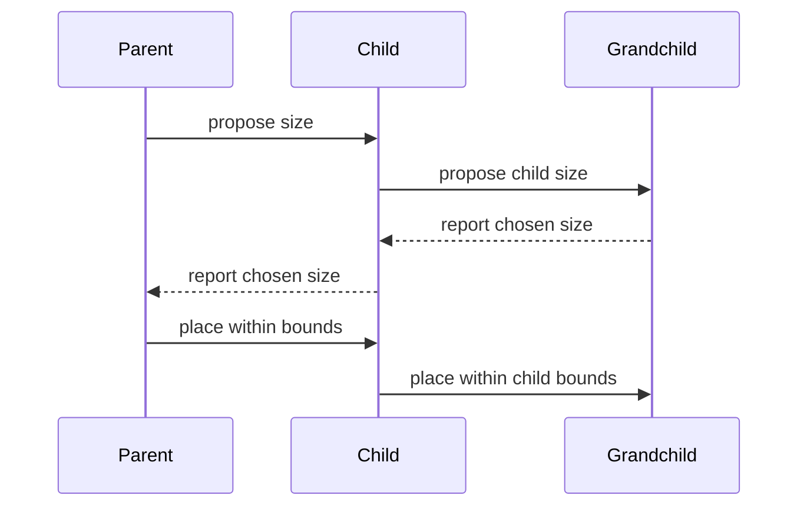

# Layout Proposal and Response: Theory

[Concept overview](README.md) · [Interview questions](interview.md)

## Mental Model

SwiftUI layout is a recursive proposal-response-placement process. A *proposal* is
the size a parent offers. A *response* is the concrete size a child chooses.
*Placement* is the position and anchor the parent assigns after measurement.

Each container repeats this process with its descendants. The child can respond
based on its content and configuration, so a proposed size is not equivalent to an
imperative frame assignment.

## How It Works

### Proposal, Response, Placement



A parent begins with space offered by its own parent. It proposes some or all of
that space to a child. The child calculates a concrete size and reports it. The
parent then chooses where to place the child within the parent's bounds.

Sizes use points, Apple's logical layout unit. Points are not the same as physical
screen pixels. The system applies the display scale later when rendering.

For a text view, the response depends on the string, font, line limit, and proposed
width. A narrow width can produce more lines and therefore a taller response. An
image, shape, stack, or control has different sizing behavior.

Width and height are negotiated independently. A proposal can specify one
dimension and leave the other unspecified. “Unspecified” means the container is
asking the child for its ideal behavior in that dimension; it does not mean zero or
infinity.

In `ProposedViewSize`, an unspecified dimension is stored as `nil`. A finite value
offers that many points. Zero and infinity are special measurement proposals used
to ask about minimum and maximum behavior. They are not instructions to create an
invisible or infinitely large interface.

Containers may measure a child several times. A stack can ask about minimum,
maximum, and ideal behavior before allocating space. Layout-related code must be
cheap and free of side effects because measurement count and order are framework
decisions.

### Standard Proposals

`ProposedViewSize` represents the contract directly for custom layouts:

| Proposal | Typical question |
|---|---|
| `.zero` | What is your minimum size? |
| `.infinity` | What is your maximum size? |
| `.unspecified` | What is your ideal size? |
| Finite width or height | What size do you choose within this offered dimension? |

These are measurement tools, not universal promises about every view's response.
A custom layout can propose one dimension at a time and use the returned sizes to
allocate space.

When implementing `Layout`, `sizeThatFits` reports the container's chosen size for
its incoming proposal. `placeSubviews` positions child proxies inside the resulting
bounds. The bounds origin is not guaranteed to be `(0, 0)`, and placement code must
use the supplied rectangle.

The `subviews` input contains `LayoutSubview` proxies, not the original view
values. A proxy lets the layout ask for size, dimensions, spacing, priority, and
custom layout values. Placement code must place each proxy exactly where the
algorithm intends.

### Modifiers Are Layout Wrappers

A modifier usually creates another view that participates in layout. Read a chain
as nested proposal and response transformations.

Padding typically subtracts its insets from the proposal sent to the child, then
adds them back to the child's response. A frame proposes dimensions to its child,
chooses its own size according to the frame constraints, and aligns the child inside
that region.

```swift
Text("Account balance")
    .padding()
    .frame(maxWidth: .infinity, alignment: .leading)
```

Here the frame expands its own available width and places the padded text at the
leading edge. The text itself does not become an infinitely wide glyph run.

Modifier order changes the wrapper structure. A background before padding covers
the unpadded content; a background after padding covers the padded response. The
same principle applies to frames, overlays, hit testing, and clipping.

### A Frame Does Not Mutate the Child

An explicit frame describes a wrapper with a chosen size. The child still responds
to a proposal and can draw beyond the wrapper if its behavior permits. Clipping is
separate:

```swift
Text(longTitle)
    .fixedSize()
    .frame(width: 120)
    .clipped()
```

`fixedSize` asks the text to use its ideal size, so it can exceed the 120-point
frame. The frame controls layout space, and `clipped` controls visible overflow.
This combination may lose content and is usually inappropriate for user text.

Use fixed dimensions only when the content and accessibility requirements make the
constraint safe. Flexible minimum and maximum constraints, semantic text styles,
and adaptive composition work better across localization and Dynamic Type.

### Ideal Size and fixedSize

`fixedSize()` makes a view use its ideal size in both dimensions by countering the
parent proposal. The axis-specific form can preserve ideal height while accepting
a proposed width, or the reverse.

This is useful when a child is being compressed unexpectedly and overflow is an
acceptable result. It is not a general truncation fix. A label using its ideal
width can exceed the screen, overlap other content, or make scrolling necessary.
First decide which view should yield space and whether wrapping is the intended
behavior.

### Flexibility and Priority

When siblings compete for limited space, the container considers their sizing
behavior. `layoutPriority(_:)` influences which child receives space before more
compressible siblings. It does not assign an absolute size and does not make the
child ignore all proposals.

Use priority to express a real content hierarchy, such as preserving a title before
a decorative detail. If many arbitrary priorities are needed, the composition may
not express the intended layout clearly. Test the hierarchy at large text sizes and
with long localized content.

A higher priority changes the order in which a container apportions limited space.
It does not guarantee that the view receives its ideal size. The container still
has to fit the complete layout into the proposal it accepts.

### Layout Size versus Drawing

The rectangle allocated during layout is not always the extent of rendered pixels.
Shadows, transforms, and offsets can draw outside layout bounds. In particular,
`offset` changes where a view is rendered without changing the space its parent
reserved, so siblings remain positioned as if the view had not moved.

Use layout modifiers or a container when sibling positions must respond to the
change. Use visual transforms when the view should move or animate without
reflowing surrounding content.

Hit testing and accessibility can also differ from visible artwork. Interactive
content needs an adequate semantic target, not merely pixels that appear large.

This distinction explains a common debugging trap: the artwork can appear outside
a temporary border while sibling placement still uses the original layout bounds.
Inspect layout and drawing separately before changing frames.

## Constraints and Guarantees

- Parents propose sizes; children return concrete sizes; parents place children.
- Proposal dimensions can be finite, zero, infinite, or unspecified.
- A child can be measured multiple times during one layout operation.
- A custom layout's unspecified proposal should produce its ideal size.
- Modifier order changes the nested layout and drawing behavior.
- A frame does not implicitly clip its child's drawing.
- Measurement count, order, and built-in container algorithms are not contracts to
  use for side effects.

## Engineering Decisions

| Symptom or need | First decision |
|---|---|
| Text truncates | Decide whether it should wrap, receive priority, or yield |
| Child exceeds a frame | Decide whether to resize, wrap, scroll, or clip |
| Siblings overlap after offset | Use layout placement if siblings should reflow |
| Content needs ideal size on one axis | Consider axis-specific `fixedSize` |
| Layout depends on available space | Prefer adaptive containers over screen bounds |
| Reusable geometry algorithm | Consider the `Layout` protocol after built-ins |

## Production Application

Debug from the hierarchy outward. Add temporary borders or backgrounds at several
modifier positions to reveal each wrapper's bounds. Reproduce with the longest
localization, accessibility text sizes, compact windows, split view, rotation, and
multitasking. Inspect which parent proposal causes the first incorrect response
instead of adding a fixed frame at the leaf.

Measure custom-layout work with realistic child counts. Cache only expensive,
repeatable measurements and invalidate the cache when inputs change. At Staff and
Principal scope, make adaptive layout behavior part of shared component contracts,
including supported size ranges, overflow policy, localization, accessibility, and
cross-platform differences.

## References

- [`ProposedViewSize`](https://developer.apple.com/documentation/swiftui/proposedviewsize)
- [`Layout`](https://developer.apple.com/documentation/swiftui/layout)
- [`fixedSize()`](https://developer.apple.com/documentation/swiftui/view/fixedsize%28%29)
- [Compose custom layouts with SwiftUI](https://developer.apple.com/videos/play/wwdc2022/10056/)
- [Inspecting view layout](https://developer.apple.com/documentation/swiftui/inspecting-view-layout)
- [Layout fundamentals](https://developer.apple.com/documentation/swiftui/layout-fundamentals)
