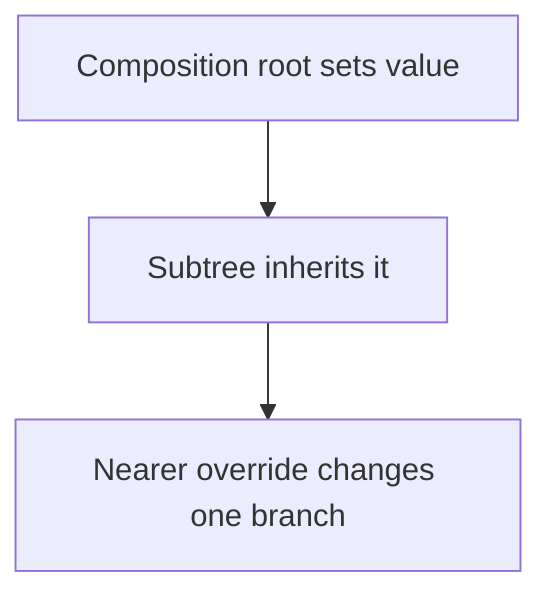

# Environment and Dependency Injection: Theory

[Concept overview](README.md) · [Interview questions](interview.md)

## Mental Model

The *environment* is typed context that flows down the view hierarchy.
*Dependency injection* means a parent or composition root supplies a dependency
instead of letting a leaf view create the live implementation. A *composition
root* is the boundary where the application chooses and connects those
implementations.



It solves repeated propagation of ambient context. It does not remove the need to
define ownership, lifetime, actor isolation, or a clear feature API.

## How It Works

### Inheritance and Overrides

SwiftUI provides built-in environment values for platform and presentation context,
including locale, calendar, color scheme, accessibility settings, scene phase, and
actions such as dismissing a presentation.

A view reads a value with `@Environment`:

```swift
struct PriceLabel: View {
    @Environment(\.locale) private var locale
    let amount: Decimal

    var body: some View {
        Text(amount, format: .currency(code: locale.currency?.identifier ?? "USD"))
    }
}
```

An ancestor can override a writable value for its subtree:

```swift
CheckoutPreview()
    .environment(\.locale, Locale(identifier: "fr_FR"))
```

The override affects that view and descendants until a nearer modifier supplies
another value. Reading the value creates a dependency, so SwiftUI can update the
affected view when it changes.

Prefer a dedicated modifier when SwiftUI provides one. A modifier may express
intent more clearly or perform propagation behavior beyond directly setting a key.
For example, use `preferredColorScheme(_:)` for a presented interface rather than
assuming a direct color-scheme assignment has identical presentation semantics.

### What Dependency Injection Changes

Without injection, a leaf view might construct a database, network client, or live
analytics service itself. That hides configuration, fixes the implementation in
place, and makes previews perform real work.

With injection, the view declares what it needs. A composition root supplies the
live implementation, while a preview or test supplies a deterministic substitute.
SwiftUI commonly uses three forms:

- an initializer parameter for a visible, feature-specific requirement;
- an environment value for inherited subtree context;
- a typed observable environment entry for a shared mutable model.

These forms solve wiring. They do not automatically define who owns a model, which
actor protects it, or how failures are reported. Those contracts still belong to
the dependency type and composition root.

### Explicit Injection versus Environment

Initializer injection keeps required dependencies visible:

```swift
struct OrderHistory: View {
    let store: OrderStore
    let analytics: AnalyticsClient

    var body: some View {
        OrderList(store: store, analytics: analytics)
    }
}
```

Prefer it when the dependency is feature-specific, required to understand the
component, or differs among nearby instances. The compiler forces each call site to
supply the dependency, which improves discoverability and tests.

Environment injection is appropriate when many nested views need the same context,
threading it through every initializer adds noise, and subtree override is useful.
Typical examples are locale-like configuration, design-system values, presentation
actions, session context, or a feature service used across several deep branches.

Do not use the environment merely to avoid constructor parameters. Hidden required
dependencies make previews fail at runtime, obscure ownership, and encourage one
application-wide container with unrelated services.

### Custom Environment Values

For current SwiftUI, define a custom value with `@Entry`:

```swift
extension EnvironmentValues {
    @Entry var analytics = AnalyticsClient.noop
}
```

Inject and read it by key path:

```swift
FeatureRoot()
    .environment(\.analytics, liveAnalytics)

struct PurchaseButton: View {
    @Environment(\.analytics) private var analytics

    var body: some View {
        Button("Buy") {
            analytics.record(.purchaseTapped)
        }
    }
}
```

The default makes the value available when no ancestor overrides it. A harmless
default is useful for optional behavior and isolated previews. It is dangerous for
a required dependency if it silently turns missing production configuration into
lost data or disabled security. Required dependencies should fail clearly during
composition or use explicit injection.

`@Entry` generates the environment-key plumbing that older code wrote manually
with an `EnvironmentKey` type and a computed `EnvironmentValues` property. The
older form remains relevant when maintaining code built with an earlier compiler,
but new code should use `@Entry`.

For shared libraries, expose a focused modifier that wraps the key-path assignment.
This gives callers a stable semantic API and leaves the key available for tests.

### Observable Models in the Environment

An owner can store an observable model in state and inject the instance by type:

```swift
struct AccountRoot: View {
    @State private var account = AccountModel()

    var body: some View {
        AccountScreen()
            .environment(account)
    }
}

struct AccountSummary: View {
    @Environment(AccountModel.self) private var account

    var body: some View {
        Text(account.displayName)
    }
}
```

The root owns the model's lifecycle policy. The environment stores and distributes
the reference, so it can participate in retaining the object. It does not decide
when a session should start, be replaced, or end. Observation tracks properties
read from that instance. If a consumer needs bindings, it can create a local
`@Bindable` projection.

Retrieving a required observable type that no ancestor supplied fails at runtime.
Every preview, test host, sheet root, and alternate app entry point must establish
the dependency. Keep the injection point near the feature root so this requirement
is easy to audit.

If absence is valid, request an optional value instead:

```swift
struct OptionalAccountBadge: View {
    @Environment(AccountModel.self) private var account: AccountModel?

    var body: some View {
        if let account {
            Text(account.displayName)
        }
    }
}
```

SwiftUI returns `nil` when no matching object is present. Use this only when the
view has meaningful behavior without the dependency. Do not make every required
model optional merely to avoid configuring previews correctly.

Type-based injection also needs clear scoping. When nested ancestors provide the
same type, the nearer value is the one descendants see. If two independent values
of the same semantic type must coexist, use explicit injection or distinct wrapper
types rather than relying on ambiguous ancestry.

### Actions as Environment Values

Environment actions decouple a reusable descendant from a concrete coordinator.
SwiftUI uses this pattern for `dismiss`, `openURL`, and other contextual operations.
A custom action type can expose one narrow operation without giving the view an
entire service object.

Read a contextual action inside the subtree where it is valid. For example, a
presented view should read its own `dismiss` action; a parent reading and passing a
different context can target the wrong presentation boundary.

An action value should make failure and concurrency behavior explicit. A closure in
the environment is not automatically `Sendable`, main-actor isolated, cancellable,
or observable. Define those contracts on the action or service type.

### Value Replacement versus Internal Mutation

Replacing an environment entry can update views that read it. Mutating hidden
state inside a reference stored in that entry is different: the environment value
itself has not been replaced. SwiftUI needs another supported observation mechanism
to learn about the internal change.

Use typed observable models when descendants render mutable model properties. Use
small, stable client or action values when descendants only invoke behavior. An
environment service should not become a notification bus whose internal mutation
is expected to refresh arbitrary views.

Immutable client structures also make preview replacement and concurrency review
easier. Their closures or collaborators can still have lifetimes and isolation
requirements, so the type should document those explicitly rather than relying on
the fact that it travels through `EnvironmentValues`.

### Composition Roots

Create live dependencies at an app, scene, or feature root rather than throughout
leaf views. The composition root chooses implementations, owns long-lived models,
and applies environment modifiers. Descendants depend on small capabilities.

For tests and previews, replace dependencies at the nearest root:

```swift
#Preview("Purchase failure") {
    PurchaseScreen()
        .environment(\.checkoutClient, .failing)
}
```

Deterministic fakes should control time, errors, and returned values without network
or persistence access. Avoid a mutable global dependency registry because tests can
leak configuration into each other and parallel execution becomes unsafe.

## Constraints and Guarantees

- Environment values propagate from an ancestor into its descendant hierarchy.
- A nearer override shadows the inherited value for that subtree.
- SwiftUI updates views that depend on an environment value when it changes.
- Custom `EnvironmentValues` entries have defaults; typed observable lookup requires
  an injected instance unless the view requests an optional.
- Environment storage can retain an observable reference, but lifecycle ownership
  remains a composition decision.
- Environment storage does not define actor isolation, sendability, persistence, or
  cancellation.

## Engineering Decisions

| Dependency | Prefer |
|---|---|
| Required by one component | Initializer injection |
| Shared throughout a deep subtree | Environment injection |
| Built-in platform or presentation context | SwiftUI environment value |
| Optional cross-cutting action | Custom `@Entry` with safe default |
| Required observable feature model | Owned at root, injected explicitly or by type |
| Two same-typed instances nearby | Explicit properties or distinct wrapper types |

## Production Application

Audit environment keys, their defaults, injection roots, and override scopes. Test
alternate scenes, previews, widgets, sheets, deep links, and restoration entry
points because they can bypass the expected root. Log configuration at composition
boundaries without exposing secrets.

At Staff and Principal scope, keep the dependency catalog small and owned. Require
each shared entry to document lifetime, default behavior, actor isolation, test
replacement, and failure policy. Migrate service locators incrementally by creating
feature composition roots and narrow capability types rather than placing the old
container into one environment key.

## References

- [`Environment`](https://developer.apple.com/documentation/swiftui/environment)
- [`EnvironmentValues`](https://developer.apple.com/documentation/swiftui/environmentvalues)
- [Environment values](https://developer.apple.com/documentation/swiftui/environment-values)
- [`Entry()`](https://developer.apple.com/documentation/swiftui/entry%28%29)
- [Managing model data in your app](https://developer.apple.com/documentation/swiftui/managing-model-data-in-your-app)
- [Migrating from ObservableObject to Observable](https://developer.apple.com/documentation/swiftui/migrating-from-the-observable-object-protocol-to-the-observable-macro)
