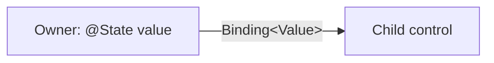

# Local State and Bindings: Theory

[Concept overview](README.md) · [Interview questions](interview.md)

## Mental Model

*State* is data that can change and affect the interface. A *source of truth* is
the one storage location treated as authoritative for a value. A *binding* gives
another view read-write access to that source without copying or owning it.

State therefore answers “who owns this mutable value and for how long?” A binding
answers “who may read and write that existing value?”



There is one storage location. The binding is a capability to access it, not a
copy and not a second owner.

## How It Works

### State Owns Local Storage

Use `@State` for transient mutable data owned by a view and its descendants:

```swift
struct SearchPanel: View {
    @State private var query = ""
    @State private var isFilterPresented = false

    var body: some View {
        VStack {
            TextField("Search", text: $query)

            Button("Filters", systemImage: "line.3.horizontal.decrease") {
                isFilterPresented = true
            }
        }
        .sheet(isPresented: $isFilterPresented) {
            FilterView()
        }
    }
}
```

SwiftUI stores these values outside the ephemeral `SearchPanel` struct and
associates them with its view identity. Mutating the state invalidates dependent
views. If the identity ends, the storage ends.

The `@State` spelling is an attribute attached to a property. Xcode 27 implements
it with the `State()` macro. Older toolchains expose `State` as a property wrapper.
The source syntax and main ownership rule remain the same.

Declare state `private`. External initialization or mutation conflicts with the
claim that this view owns the value. Lift the state to a parent when a larger
subtree needs to coordinate it.

Local state is appropriate for selection, presentation, draft text, and other
UI-session values. It is not durable storage. A view being
removed can destroy its state, and the operating system can terminate the process.
Persist business data through the model and persistence layers.

### Inputs Are Not State

Use an ordinary stored property for a read-only input:

```swift
struct EpisodeRow: View {
    let episode: Episode

    var body: some View {
        Text(episode.title)
    }
}
```

The parent can create a new `EpisodeRow` value whenever the input changes. The
child does not need to copy the value into state to make the UI update.

Copying an input into `@State` creates a separate source of truth. The initializer
provides the value only when SwiftUI first creates storage for that identity.
Later parent updates do not overwrite established state. This is useful for an
intentional draft, but the component must define reset, commit, and conflict rules.
If the parent remains the owner, pass a value or binding instead.

### Initializing State from an Input

Sometimes a view intentionally creates local state from an initial input. For
example, an editor might start with a copy that the user can cancel before saving:

```swift
struct NameEditor: View {
    @State private var draftName: String

    init(initialName: String) {
        draftName = initialName
    }

    var body: some View {
        TextField("Name", text: $draftName)
    }
}
```

This code initializes a new editing session. It does not keep `draftName` equal to
later `initialName` values. The view must define what starts a new session and how
external changes are handled.

Xcode 27 makes two initialization rules especially important:

1. Initialize ordinary stored properties before assigning to a `@State` property
   in `init`.
2. If `init` supplies the state value, do not also give that property an inline
   default. The inline value takes precedence and the assignment is discarded.

For example, `@State private var draftName = ""` combined with
`draftName = initialName` in `init` does not produce the intended result. Choose
one source for the initial value. In most views, an inline default is the simplest
choice. Use initializer-supplied state only when the value truly begins a new local
session.

### Bindings Borrow Mutable Access

A `Binding<Value>` reads and writes storage owned elsewhere:

```swift
struct PlayButton: View {
    @Binding var isPlaying: Bool

    var body: some View {
        Button(isPlaying ? "Pause" : "Play") {
            isPlaying.toggle()
        }
    }
}

struct PlayerView: View {
    @State private var isPlaying = false

    var body: some View {
        PlayButton(isPlaying: $isPlaying)
    }
}
```

The `$` accesses `State`'s projected value, which is a binding. In the child,
reading or assigning `isPlaying` uses the binding's wrapped value. The child does
not control storage initialization or lifetime.

The property-wrapper syntax hides a normal initializer parameter. Swift synthesizes
an initializer that accepts `Binding<Bool>` for `PlayButton`, so the parent passes
`$isPlaying`, not the current Boolean value. Passing `isPlaying` without `$` would
be a type error because that expression is a `Bool`, not a `Binding<Bool>`.

Bindings can project writable members through dynamic member lookup. If a parent
owns an editable structure in state, `$profile.displayName` can produce a binding
to that field without creating another stored copy.

Pass a plain value when a child only reads. A binding expands the child's authority
and couples it to synchronous mutation. The API should make that authority
intentional.

### Binding versus Value and Action

Two-way binding fits controls whose purpose is editing a value: toggles, text
fields, sliders, selections, and reusable form components. A domain operation often
needs a narrower interface:

```swift
struct SubscriptionRow: View {
    let isSubscribed: Bool
    let subscribe: () -> Void

    var body: some View {
        Button(isSubscribed ? "Subscribed" : "Subscribe", action: subscribe)
            .disabled(isSubscribed)
    }
}
```

A raw `Binding<Bool>` could let the row unsubscribe, skip authorization, or bypass
analytics and persistence rules. A value plus a named action expresses the allowed
transition. For richer domains, call a model method or send a typed event.

Use the narrowest contract that supports the UI. This improves testing and keeps
validation, authorization, and side effects with their owner.

### Observable Models and Bindable

`@Bindable` does not own an observable model. It creates bindings to mutable
properties of an injected `@Observable` instance:

```swift
struct BookEditor: View {
    @Bindable var book: Book

    var body: some View {
        TextField("Title", text: $book.title)
    }
}
```

Use `@State` when the view owns the observable instance and `@Bindable` where a
consumer needs bindings to that instance's properties. A plain property is enough
when the consumer only reads it. Observable model ownership is covered in the next
concept.

`@Bindable` is not a replacement for every `@Binding`. Use `@Binding` for a value
whose storage already exists elsewhere. Use `@Bindable` to project bindings from
the mutable properties of an observable reference model.

### Custom Bindings

`Binding(get:set:)` adapts storage that does not already expose a binding. It can be
valid at an integration boundary, but inline custom bindings are easy to misuse:

- the getter and setter may disagree about normalization;
- the setter can hide I/O or trigger reentrant updates;
- a fallback value can silently discard writes;
- repeated construction obscures the actual owner;
- tests may miss transaction or lifetime behavior.

Prefer a binding projected from `@State`, `@Binding`, or `@Bindable`. If a simple
write needs an additional reaction, use an explicit model method or a focused
`onChange` handler with a clear side-effect policy. Do not put persistence or
network work inside a generic binding setter.

### Source-of-Truth Placement

Place mutable UI state at the lowest common ancestor that needs to coordinate it.
Too low creates duplicate owners. Too high creates a broad model that invalidates
unrelated features and becomes difficult to reset or test.

Ask these questions:

1. Which component creates and destroys the value?
2. Which views only read it?
3. Which views are allowed to mutate it?
4. Is it transient UI state, a local draft, or durable domain data?
5. What should happen when identity, navigation, or external data changes?

The answers determine whether to use a value, binding, local state, or an observable
model boundary.

## Constraints and Guarantees

- SwiftUI manages `@State` storage for a view identity.
- A binding references storage elsewhere and does not own its lifetime.
- State's projected value provides a binding to the stored value.
- Binding projection can provide writable access to members of a mutable value.
- State lifetime follows view lifetime and is not persistence.
- A sendable binding does not guarantee that cross-isolation reads and writes are
  safe; safety depends on how the binding was created.
- Xcode 27 state initialization follows normal stored-property initialization
  ordering and does not let an `init` assignment override an inline default.

## Engineering Decisions

| Need | Prefer |
|---|---|
| Private transient UI value | `@State private` |
| Read-only child input | `let` property |
| Child edits parent-owned value | `@Binding` |
| View needs bindings to an observable model | `@Bindable` |
| Domain transition with validation or effects | Value plus action or model method |
| Local editing session | Owned draft state with explicit commit and reset policy |
| Adapter to non-SwiftUI storage | Focused custom binding, used sparingly |

## Production Application

State bugs often appear as edits that reset, stale copies of parent data, sheets
controlled by multiple flags, or child views mutating more than intended. Test
identity changes, parent input changes, cancellation, dismissal, and simultaneous
editors. Verify that only one owner commits durable data.

Keep UI state on the intended actor. Binding conformance to `Sendable` does not make
arbitrary wrapped storage safe to mutate from any task. For shared component APIs,
document who owns each binding, which values are valid, and whether writes are
immediate drafts or committed domain changes. At Staff and Principal scope,
standardize these contracts across design-system controls and feature boundaries.

## References

- [`State`](https://developer.apple.com/documentation/swiftui/state)
- [`Binding`](https://developer.apple.com/documentation/swiftui/binding)
- [`Bindable`](https://developer.apple.com/documentation/swiftui/bindable)
- [Managing user interface state](https://developer.apple.com/documentation/swiftui/managing-user-interface-state/)
- [Model data](https://developer.apple.com/documentation/swiftui/model-data)
- [TN3211: Resolving SwiftUI source incompatibilities for State and ContentBuilder](https://developer.apple.com/documentation/technotes/tn3211-resolving-swiftui-source-incompatibilities-for-state-and-contentbuilder)
