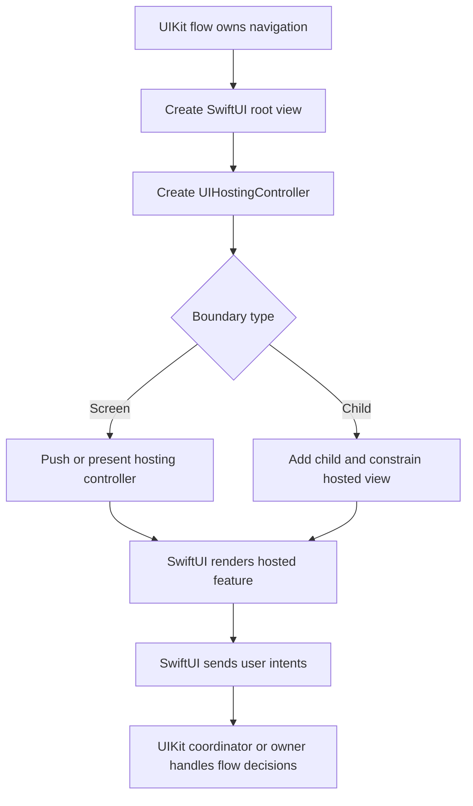

# Hosting SwiftUI in UIKit: Theory

[Concept overview](README.md) · [Interview questions](interview.md)

## Mental Model

Hosting SwiftUI in UIKit is the opposite direction from
`UIViewRepresentable`. UIKit remains the outer owner. SwiftUI renders a subtree
inside a `UIHostingController`, or inside a cell through `UIHostingConfiguration`.

The boundary decision is mostly about ownership. UIKit owns navigation
controllers, presentation, containment, and view-controller lifecycle. SwiftUI
owns the local view description and invalidation inside the hosted root.

## Hosting Shapes

| Shape | Use when | Main risk |
|---|---|---|
| `UIHostingController` as a screen | A UIKit flow pushes or presents a SwiftUI feature. | Split navigation ownership |
| `UIHostingController` as a child | A UIKit screen embeds a SwiftUI section. | Incorrect containment or sizing |
| `UIHostingConfiguration` | A cell needs SwiftUI content in a modern list. | State tied to cell reuse |

`UIHostingController` is a real view controller. When embedding it, use normal
UIKit containment: add it as a child, add its view, constrain the view, then call
`didMove(toParent:)`. Remove it with the matching removal calls.



## State and Actions

The hosted root view should receive a clear contract. Prefer values for display,
bindings for local editable state, and closures or actions for user intents.
Observable models can be appropriate, but they should have an explicit owner.

```swift
final class ProfileViewController: UIViewController {
    private let model: ProfileModel

    init(model: ProfileModel) {
        self.model = model
        super.init(nibName: nil, bundle: nil)
    }

    required init?(coder: NSCoder) {
        fatalError("init(coder:) has not been implemented")
    }

    override func viewDidLoad() {
        super.viewDidLoad()

        let root = ProfileHeaderView(
            name: model.name,
            onEdit: { [weak self] in self?.showEditor() }
        )
        let hosting = UIHostingController(rootView: root)

        addChild(hosting)
        view.addSubview(hosting.view)
        hosting.view.translatesAutoresizingMaskIntoConstraints = false
        NSLayoutConstraint.activate([
            hosting.view.leadingAnchor.constraint(equalTo: view.leadingAnchor),
            hosting.view.trailingAnchor.constraint(equalTo: view.trailingAnchor),
            hosting.view.topAnchor.constraint(equalTo: view.topAnchor)
        ])
        hosting.didMove(toParent: self)
    }
}
```

This example keeps navigation in UIKit. The SwiftUI view exposes an edit intent
without knowing how the surrounding UIKit stack presents the editor.

## Layout and Lifecycle

Hosted SwiftUI content participates in UIKit layout through the hosting
controller's view. The main production issues are sizing, safe areas, and update
timing.

For full-screen hosted features, the navigation and safe-area behavior should
match the surrounding UIKit flow. For child content, constrain the hosted view
like any other UIKit subview. If the SwiftUI content has dynamic height, verify
how the parent measures and updates it, especially inside scrolling containers.

Avoid creating a new hosting controller every time data changes. Update the
model or assign a new `rootView` only when that is the intended identity boundary.
Unnecessary recreation loses SwiftUI local state and can restart `.task` work.

## Engineering Decisions

Hosting is a good migration step when UIKit owns a large existing flow and one
screen or section can move to SwiftUI safely. It is also useful for new isolated
features in a UIKit app.

The boundary is weak when SwiftUI owns a navigation decision that UIKit also
models, or when both sides mutate the same domain state. In those cases, make the
contract explicit:

| Concern | Prefer |
|---|---|
| Navigation in a UIKit flow | SwiftUI emits intents; UIKit performs routing |
| Shared state | One owner, passed through a narrow model or binding |
| Analytics and side effects | Owner at the feature boundary, not hidden in views |
| Cancellation | Tie async work to the feature owner or visible SwiftUI lifecycle |

For Staff and Principal scope, the question is whether hosting allows a planned
migration or creates a permanent mixed architecture. The answer should include
ownership, testing, rollout, and removal criteria.

## References

- [UIHostingController](https://developer.apple.com/documentation/swiftui/uihostingcontroller)
- [UIHostingConfiguration](https://developer.apple.com/documentation/swiftui/uihostingconfiguration)
