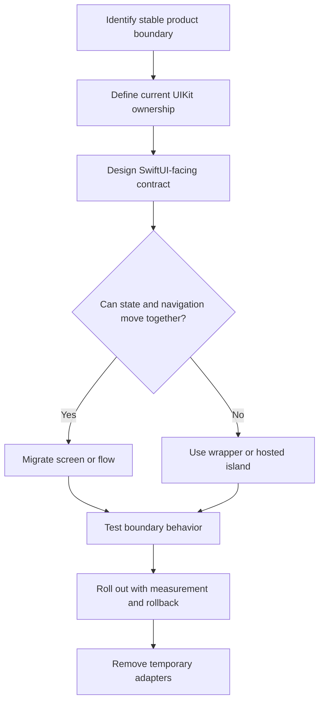

# Incremental Migration and Framework Boundaries: Theory

[Concept overview](README.md) · [Interview questions](interview.md)

## Mental Model

UIKit-to-SwiftUI migration is an ownership problem before it is a syntax problem.
The hard questions are who owns navigation, source of truth, lifecycle, side
effects, and design-system behavior while both frameworks coexist.

Good migration reduces risk by moving one coherent boundary at a time. Poor
migration creates many mixed screens where UIKit and SwiftUI both believe they
own part of the same state.

## Choosing a Boundary

Prefer boundaries that already have product meaning and testable behavior.

| Boundary | When it works | Risk |
|---|---|---|
| Leaf component | Visual component has simple inputs and actions. | Too many tiny islands |
| Screen | Screen has clear ownership and limited external flow. | Surrounding UIKit navigation still leaks in |
| Feature flow | Navigation, state, and effects can move together. | Larger rollout and compatibility cost |
| Platform component | Shared UI pattern can be adopted broadly. | Requires standards and support ownership |

The right boundary depends on risk. For a high-traffic checkout or onboarding
flow, migrate behind a feature flag or start with a leaf component. For a new
isolated feature, a full SwiftUI screen or flow can be simpler.

## Migration Flow

The key checkpoint is whether state and navigation can move together. If they
cannot, the wrapper contract must be narrow enough to prevent hidden duplicated
ownership.

## Framework Boundaries

A migration boundary should define what crosses it:

| Concern | Boundary rule |
|---|---|
| State | One authoritative owner; derived values can cross as inputs |
| Navigation | One router or coordinator owns the user journey |
| Side effects | Effects live in dependencies or feature owners, not passive views |
| Layout | Parent framework owns outer sizing; child owns internal composition |
| Accessibility | Test the combined tree, not only the migrated component |
| Lifecycle | Tie async work and observers to the owner that controls lifetime |

Wrappers should translate, not decide. `UIViewRepresentable` translates UIKit
views into SwiftUI. `UIHostingController` translates SwiftUI views into UIKit.
Neither should become an undocumented architecture layer.

## Engineering Decisions

Use incremental migration when a full rewrite would create too much delivery,
regression, or training risk. It is also useful when UIKit still provides mature
capabilities that SwiftUI does not replace well for the app's needs.

Avoid migration work that only changes syntax. A screen rewritten in SwiftUI but
still backed by unclear global state, hidden side effects, and inconsistent
navigation is not a meaningful architecture improvement.

At Staff and Principal scope, define standards:

- Which framework owns new features by default.
- How shared dependencies are injected across both frameworks.
- When wrappers are temporary versus approved long-term infrastructure.
- Which tests and metrics are required before rollout.
- How teams remove old UIKit code after adoption succeeds.

## Production Application

Migration should have observability and reversal. Track crash rate, hangs,
layout regressions, accessibility failures, conversion metrics for product flows,
and user-reported issues. For risky flows, keep rollback possible until the new
boundary has proven stable.

Testing should cover both frameworks together. Unit tests can check state
translation, but integration and UI tests should cover navigation, presentation,
dynamic type, VoiceOver labels, deep links, and cancellation during dismissal.

The end state should be simpler than the transition state. If temporary adapters,
dual models, or old coordinators remain forever, the migration has added another
architecture instead of replacing one.

## References

- [UIViewRepresentable](https://developer.apple.com/documentation/swiftui/uiviewrepresentable)
- [UIHostingController](https://developer.apple.com/documentation/swiftui/uihostingcontroller)
- [UIHostingConfiguration](https://developer.apple.com/documentation/swiftui/uihostingconfiguration)
