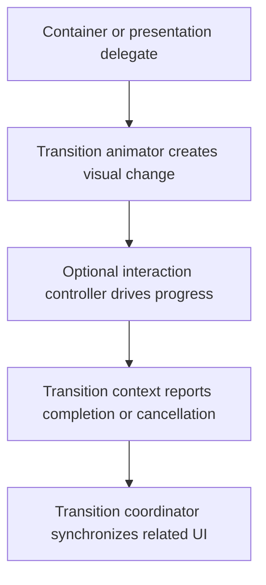

# View Controller Transitions and Coordinators: Theory

[Concept overview](README.md) · [Interview questions](interview.md)

## Mental Model

A view-controller transition changes both hierarchy and presentation. UIKit owns the
transaction, supplies a container and context, and asks app-provided objects to
customize specific responsibilities.



Prefer system navigation, sheets, popovers, and presentations. Their transitions
already handle adaptation, accessibility, gestures, and platform consistency. Add a
custom transition only when it communicates a relationship the system transition
cannot express.

## Prefer a System Fluid Transition

On iOS 18 and later, set a destination controller's `preferredTransition` to a
system zoom transition when a source cell or preview expands into its detail. The
system provides continuous interaction and lifecycle integration without a custom
animator:

```swift
editor.preferredTransition = .zoom { context in
    let editor = context.zoomedViewController as? EditorViewController
    return editor.flatMap { self.cell(for: $0.documentID) }
}
```

UIKit calls the source-view provider for presentation and dismissal. Capture stable
identity and resolve the current view each time because a collection cell can be
reused or move offscreen. Use a custom transition only when the system transition
cannot represent the required relationship or interaction.

## Transition Responsibilities

For a custom modal transition, set `modalPresentationStyle` to `.custom` and assign a
`UIViewControllerTransitioningDelegate`. The delegate can vend separate objects:

| Object | Responsibility |
|---|---|
| `UIViewControllerAnimatedTransitioning` | Duration and view animation |
| `UIViewControllerInteractiveTransitioning` | Gesture-driven progress |
| `UIPresentationController` | Dimming, chrome, sizing, and adaptation |

A navigation controller gets its animator and interaction controller from a
`UINavigationControllerDelegate`. Keep destination construction and routing policy
outside the animator. The animator should not decide where the app navigates.

`transitioningDelegate` is weak. The flow must retain the delegate for the required
lifetime. Losing it before presentation or dismissal can silently restore default
behavior or break the paired transition.

## Use the Transition Context

The transition context is the source of truth for involved controllers, views,
container, final frames, and cancellation. Do not assume `controller.view` is always
the exact view UIKit wants animated. Ask for `.from` and `.to` views through the
context.

This simplified animator shows the presentation direction:

```swift
final class CardPresentAnimator: NSObject,
    UIViewControllerAnimatedTransitioning {

    func transitionDuration(
        using context: UIViewControllerContextTransitioning?
    ) -> TimeInterval {
        0.25
    }

    func animateTransition(
        using context: UIViewControllerContextTransitioning
    ) {
        guard
            let toController = context.viewController(forKey: .to),
            let toView = context.view(forKey: .to)
        else {
            context.completeTransition(false)
            return
        }

        let container = context.containerView
        toView.frame = context.finalFrame(for: toController)
        toView.alpha = 0
        toView.transform = CGAffineTransform(scaleX: 0.96, y: 0.96)
        container.addSubview(toView)

        UIView.animate(
            withDuration: transitionDuration(using: context),
            delay: 0,
            options: [.curveEaseOut],
            animations: {
                toView.alpha = 1
                toView.transform = .identity
            },
            completion: { _ in
                let completed = context.transitionWasCancelled == false
                if completed == false {
                    toView.removeFromSuperview()
                }
                context.completeTransition(completed)
            }
        )
    }
}
```

Every path must call `completeTransition(_:)` exactly once. Pass `false` after
cancellation. Otherwise UIKit can keep the hierarchy and appearance lifecycle in an
incomplete state.

Use `finalFrame(for:)` and container bounds instead of cached screen coordinates.
The transition may run in a sheet, split view, resized window, or rotated
environment. Dismissal must also restore the source view when interaction cancels.

## Build Interruptible Transitions

An animator can implement `interruptibleAnimator(using:)` and return a
`UIViewPropertyAnimator`. UIKit requires the same animator instance for the duration
of that transition. Cache it by the current transition, then clear it after
completion.

The property animator should configure the same final hierarchy as
`animateTransition(using:)`. One common pattern is to create the property animator in
a helper, return it from `interruptibleAnimator`, and start it from
`animateTransition`. Avoid creating a different animator on each callback.

Interactive control is separate. The transitioning or navigation delegate vends an
interaction controller only for a transition that is actively gesture-driven.

## Coordinate Related UI

`UIViewControllerTransitionCoordinator` exists only during a transition. Use it to
animate bars, backgrounds, or custom chrome alongside navigation, presentation, or
rotation:

```swift
transitionCoordinator?.animate(
    alongsideTransition: { _ in
        self.chromeView.alpha = 0
    },
    completion: { context in
        if context.isCancelled {
            self.chromeView.alpha = 1
        }
    }
)
```

This is more accurate than starting an unrelated animation in `viewWillAppear`.
Alongside animations inherit transition timing and interactive progress. The context
also reports cancellation.

Use a `UIPresentationController` for dimming views, decoration, sizing, and adaptive
presentation behavior. It outlives either direction's animator. Add and remove its
views in presentation lifecycle methods, and coordinate their animation through the
transition coordinator.

## Production Decisions

Custom transitions add gesture conflicts, cancellation paths, adaptation work,
accessibility policy, and test cost. Test presentation and dismissal, interrupted
progress, rotation or resizing, backgrounding, Reduce Motion, and VoiceOver focus.

Keep logical navigation state independent of pixels. Update durable route ownership
from the actual completed or canceled outcome, not from an assumed duration.

At Staff scope, define who owns transition delegates, interaction controllers, and
system-transition exceptions. Shared transitions need a compatibility and rollout
plan because one defect can affect every adopting feature.

## References

- [View controller transitions](https://developer.apple.com/documentation/uikit/view-controller-transitions)
- [`UIViewController.preferredTransition`](https://developer.apple.com/documentation/uikit/uiviewcontroller/preferredtransition)
- [WWDC24: Enhance your UI animations and transitions](https://developer.apple.com/videos/play/wwdc2024/10145/)
- [`UIViewControllerAnimatedTransitioning`](https://developer.apple.com/documentation/uikit/uiviewcontrolleranimatedtransitioning)
- [`interruptibleAnimator(using:)`](https://developer.apple.com/documentation/uikit/uiviewcontrolleranimatedtransitioning/interruptibleanimator(using:))
- [`UIViewControllerTransitionCoordinator`](https://developer.apple.com/documentation/uikit/uiviewcontrollertransitioncoordinator)
- [`UIPresentationController`](https://developer.apple.com/documentation/uikit/uipresentationcontroller)
