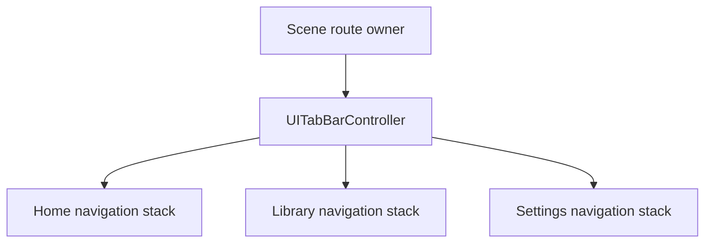

# Tabs and Top-Level Navigation: Theory

[Concept overview](README.md) · [Interview questions](interview.md)

## Mental Model

`UITabBarController` is a container view controller. It switches among peer areas
of an app, such as Home, Library, and Settings. It is not a replacement for a
navigation stack. A common hierarchy gives each tab its own navigation controller:



This preserves context when the user switches tabs. The Home detail stack can stay
intact while the user checks Settings, then returns. The scene route owner decides
which tab is active. Each tab's flow owner decides what its navigation stack means.

Tabs should represent destinations at the same level. If one item is the next step
after another, use push navigation or a task-specific flow instead. Changing tabs
should change context, not act as an unlabeled Back or Next button.

## Define Stable Tabs

On supported systems, `UITab` gives a tab a stable identifier, title, image, and a
closure that creates its controller. `UITabGroup` can group related destinations
for adaptive sidebar presentation.

```swift
let library = UITab(
    title: "Library",
    image: UIImage(systemName: "books.vertical"),
    identifier: "library"
) { _ in
    UINavigationController(
        rootViewController: LibraryViewController(store: store)
    )
}

let settings = UITab(
    title: "Settings",
    image: UIImage(systemName: "gearshape"),
    identifier: "settings"
) { _ in
    UINavigationController(
        rootViewController: SettingsViewController(settings: settingsStore)
    )
}

let tabs = UITabBarController(tabs: [library, settings])
```

For older deployment targets, configure `viewControllers` and each root
controller's `tabBarItem`. The ownership model stays the same. Keep app route state
in terms of a domain identifier such as `library`, not `selectedIndex == 1`.
Indexes change when tabs are reordered, filtered for compact presentation, or added
during a rollout.

Avoid recreating every child controller whenever selection changes. Replacing the
controller loses its stack, scroll position, drafts, and in-flight work. Create a
new flow only when the product explicitly resets that destination.

## Route and Restore State

A deep link has two parts: the destination tab and the route inside that tab. Apply
them in that order:

1. Parse and validate the external route.
2. Select the owning tab by stable identifier.
3. Ask that tab's flow owner to build a coherent stack or select content.
4. Present a modal only after the target hierarchy is ready.

Do not push a detail controller onto whichever navigation controller happens to be
visible. That can put Library content inside the Settings flow and make Back
navigation meaningless.

Restoration follows the same split. Store the selected tab as stable route state.
Let each flow restore only the state it owns. Validate restored identifiers because
features, permissions, and account state may have changed since the session was
saved. A missing destination needs a safe fallback, usually the tab's root.

Reselecting the current tab is a product decision. Some apps pop to root or scroll
to top; others preserve the exact position. Do not attach that behavior accidentally
to every selection callback. Define it, make it discoverable, and avoid destroying
unsaved work.

## Adapt Standard Containers

Modern `UITabBarController` can present tabs as a bottom bar or sidebar depending on
platform and available space. `UITab` and `UITabGroup` let the same destination model
participate in that adaptation. Use the controller's layout guides and safe areas
instead of adding fixed bottom padding for the bar.

Current UIKit also supports a system search tab, tab-bar minimization during
scrolling, and a bottom accessory for persistent content such as a mini player.
These APIs preserve system layout, accessibility, and transitions:

```swift
if #available(iOS 26.0, *) {
    tabs.tabBarMinimizeBehavior = .onScrollDown
    tabs.bottomAccessory = UITabAccessory(contentView: miniPlayerView)
}
```

Treat an accessory as shared top-level UI. It should receive compact state or
actions through a narrow interface, not reach into the selected child controller.
When the system moves it inline with a minimized bar, its content must adapt to the
smaller space.

Prefer these container capabilities over a custom tab bar. Custom chrome must
rebuild selection behavior, safe-area coordination, keyboard and pointer support,
VoiceOver order, restoration, appearance changes, and future platform adaptation.
That cost is justified only when standard tabs cannot express a required product
interaction.

## Engineering Decisions

| Decision | Prefer | Cost to check |
|---|---|---|
| Peer app destinations | Tabs | Each destination needs a distinct, stable purpose |
| Steps within one task | Navigation stack or flow | Back and completion must remain clear |
| Independent history per destination | One navigation stack per tab | More retained controller and view state |
| Shared route from a notification | Scene-level route owner | Must select the correct scene and tab first |
| Many destinations on iPad | Adaptive tab and sidebar model | Grouping and customization need stable identifiers |
| Branded custom tab surface | Standard container first | Accessibility, adaptation, and migration burden |

At Staff scope, define the tab contract across teams: identifiers, ownership of each
root flow, deep-link routing, restoration, analytics meaning, and rules for optional
tabs. Roll out tab changes with migrations for persisted selection. Adding a feature
flag must not make an old index point to a different destination.

## References

- [`UITabBarController`](https://developer.apple.com/documentation/uikit/uitabbarcontroller)
- [`UITab`](https://developer.apple.com/documentation/uikit/uitab)
- [`UITabGroup`](https://developer.apple.com/documentation/uikit/uitabgroup)
- [Elevate your tab and sidebar experience in iPadOS](https://developer.apple.com/videos/play/wwdc2024/10147/)
- [Build a UIKit app with the new design](https://developer.apple.com/videos/play/wwdc2025/284/)
