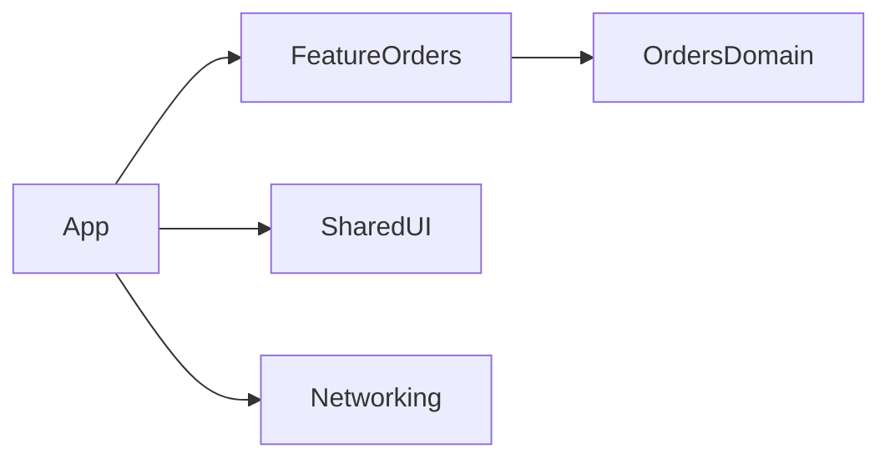

# Dependency Injection and Feature Modularization: Theory

[Concept overview](README.md) · [Interview questions](interview.md)

## Mental Model

Dependency injection means an object receives the collaborators it needs instead
of creating or locating them itself. In UIKit, that usually means a view
controller, view model, coordinator, or service is initialized with its required
dependencies.

Modularization is the larger boundary. It decides which features, layers, or
shared APIs compile together and which dependencies are allowed.

## Dependency Injection in UIKit

Constructor injection is the clearest default for required dependencies:

```swift
final class OrdersViewController: UIViewController {
    private let store: OrdersStore
    private let imageLoader: ImageLoading

    init(store: OrdersStore, imageLoader: ImageLoading) {
        self.store = store
        self.imageLoader = imageLoader
        super.init(nibName: nil, bundle: nil)
    }

    @available(*, unavailable)
    required init?(coder: NSCoder) {
        fatalError("Use init(store:imageLoader:)")
    }
}
```

This makes required collaborators visible. It also makes tests simpler because a
test can pass a fake store or image loader without changing global state.

Factory injection fits UIKit flows because many controllers are created during
navigation. A coordinator or feature builder can own construction:

```swift
struct OrdersFeatureFactory {
    let api: OrdersAPI
    let imageLoader: ImageLoading

    func makeOrdersScreen() -> UIViewController {
        OrdersViewController(
            store: OrdersStore(api: api),
            imageLoader: imageLoader
        )
    }
}
```

Avoid making every object reach into a global container. A dependency container
can be useful at the composition root, but service location inside feature code
hides requirements and weakens tests.

## Protocol Boundaries

Protocols are useful when they define what the caller needs. They should not be
automatic copies of every concrete type.

Place a protocol near the feature when the feature owns the need:

```swift
protocol ImageLoading {
    func image(for url: URL) async throws -> UIImage
}
```

That feature can test against the behavior it depends on. The app assembly can
bind the protocol to a concrete image loader.

Use a concrete type directly when there is no real substitute, no cross-module
boundary, and no useful test double. Too many protocols add maintenance without
improving design.

## Modularization

Modularization turns ownership into compile-time structure. A UIKit app might
have modules by feature, by layer, or a hybrid:



Feature modules work well when teams own product areas. Layer modules work well
when platform capabilities are reused across many features. Shared modules need
strict review because they can become dumping grounds.

Swift Package Manager targets and Xcode frameworks can both express module
boundaries. The important rule is the dependency direction, not the tool.

## Benefits and Costs

Dependency injection improves testability, replacement, and clarity. It also
forces construction decisions to be explicit. The cost is wiring. A small app
can become harder to follow if every screen has a factory, resolver, and
protocol for dependencies that never vary.

Modularization can improve build times, ownership, and API discipline. It can
also slow development if boundaries are premature. Moving code across modules
requires public API design, dependency graph management, and release
coordination.

## Engineering Decisions

Use injection when a dependency performs I/O, owns state, crosses a feature
boundary, needs a test double, or may change by environment. Direct construction
is acceptable for simple value objects and private helpers.

Use modularization when the codebase has real pressure: many developers touching
the same areas, slow builds, feature ownership, reusable products, or migration
work that needs isolation.

For Staff and Principal interviews, describe the rollout. Start with a feature
or boundary that already has ownership pressure. Define allowed dependencies,
move tests with the code, and measure whether the new boundary improves build
time, defect isolation, or team autonomy.

## Production Application

Good DI and module boundaries make these questions easy:

| Question | Good signal |
|---|---|
| Can tests replace I/O? | Services are injected behind narrow interfaces. |
| Can a feature build without the whole app? | The module has explicit dependencies. |
| Can ownership be enforced? | Dependency direction is visible in package or project structure. |
| Can UIKit migrate gradually? | UIKit adapters are separate from domain and service code. |

Watch for these smells:

- View controllers construct network clients directly.
- Tests mutate global singletons and leak state between cases.
- Shared modules contain feature-specific rules.
- Protocols mirror concrete types without reducing coupling.
- Module cycles force unrelated teams to coordinate every change.

## References

- [PackageDescription: Package](https://docs.swift.org/package-manager/PackageDescription/PackageDescription.html)
- [PackageDescription: Target](https://docs.swift.org/package-manager/PackageDescription/PackageDescription.html#target)
- [UIViewController](https://developer.apple.com/documentation/uikit/uiviewcontroller)
