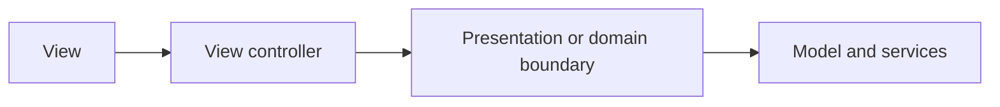

# MVC and View Controller Boundaries: Theory

[Concept overview](README.md) · [Interview questions](interview.md)

## Mental Model

UIKit is built around view controllers. A view controller owns a screen or part
of a screen, manages its view hierarchy, reacts to user events, coordinates
navigation, and moves data between views and the app model.

That does not mean every screen rule belongs in the view controller. In UIKit MVC,
the controller connects the view to app behavior. It is not the default owner of
every business rule, network request, or long-lived piece of state.

## How UIKit MVC Works

In Model-View-Controller, model objects own app data and product rules. View objects
draw and receive user interaction. Controller objects pass information and actions
between the model and view.

UIKit makes `UIViewController` the common controller object. It has lifecycle
hooks, access to the root view, navigation and presentation APIs, trait changes,
and responder-chain behavior. This makes it a natural place to connect screen
events to app behavior.

The boundary should usually look like this:

The view can expose controls, layout, and reusable visual behavior. The view
controller can translate taps, delegate callbacks, and lifecycle events into
commands. The model or application boundary decides what those commands mean.

For example, a checkout controller can read text fields, show validation
messages, and disable a button while submitting. It should not own tax rules, retry
policy, the steps of payment processing, or the storage format.

## Responsibilities

Use the controller for work tied to UIKit lifecycle and presentation:

| Belongs in the view controller | Usually belongs elsewhere |
|---|---|
| Loading and configuring views | Pricing, eligibility, and domain rules |
| Responding to button taps and delegate callbacks | Network clients and persistence code |
| Starting and cancelling screen-scoped work | Shared cache ownership |
| Applying view state to labels, buttons, and lists | Cross-screen app state |
| Navigation decisions local to the current flow | Product policy and workflow rules |

This is not a rule about file size. A short controller can still be poorly
bounded if it directly knows too much about services, storage, and feature
policy. A longer controller can be acceptable when it is mostly view setup for a
complex UIKit screen.

## Benefits and Costs

UIKit MVC fits small screens well because it has low ceremony. It also aligns
with framework APIs. Delegates, target-action, navigation controllers, and view
lifecycle methods all naturally call into a view controller.

The cost is that `UIViewController` has many reasons to change. A single class
can collect layout, data loading, event handling, navigation, analytics,
formatting, validation, and error handling. This creates the common "massive
view controller" problem.

The fix is not always to replace MVC with a named architecture. The first fix is
to create clearer ownership:

- Move pure formatting into small value types or formatter objects.
- Move asynchronous loading behind a protocol or service.
- Move screen state transitions into a view model or presenter when they become
  complex.
- Move navigation ownership into a coordinator when multiple screens share a
  flow.
- Keep views and cells as configurable outputs, not owners of app decisions.

## Engineering Decisions

Choose the boundary based on change pressure.

If a rule is reused across screens, tested without UIKit, or owned by a backend
or product contract, keep it outside the view controller. If a rule only adapts
the current screen to a size class, selection state, or UIKit event, keeping it
in the controller is often simpler.

For Senior interviews, explain where code belongs and how you would test it.
For Staff and Principal interviews, also discuss migration risk. Large apps may
need rules for dependency direction, ownership of feature state, and how new
screens avoid adding more behavior to legacy controllers.

A useful adoption path is incremental:

1. Identify one reason the controller changes too often.
2. Extract that reason behind a small boundary.
3. Add tests at the new boundary.
4. Keep the controller as the adapter between UIKit and that boundary.

Avoid over-correcting. A screen with simple static content does not need a view
model, coordinator, repository, and dependency container. Extra layers should
pay for themselves through testability, reuse, lifecycle control, or reduced
coupling.

## Production Application

Controller boundaries matter most when lifecycle and asynchronous work meet.
UIKit may load a view, remove it, reuse child views, present another controller,
or receive trait changes while work is in flight. If a controller owns long-lived
state without clear cancellation and ownership, bugs often appear as stale UI,
duplicate requests, retained flows, or hard-to-reproduce navigation issues.

Good production boundaries make these questions easy to answer:

| Question | Good signal |
|---|---|
| Who owns the source of truth? | A model store, view model, or service has clear ownership. |
| Who cancels screen-scoped work? | The controller or view model ties tasks to the screen lifetime. |
| Can rules be tested without UIKit? | Domain and presentation decisions run in unit tests. |
| Can the screen migrate to SwiftUI later? | UIKit-specific code is mostly at the edge. |

Use UIKit tests for lifecycle and navigation behavior. Use unit tests for rules,
state transitions, formatting, and service interaction. That split keeps tests
fast and avoids treating `UIViewController` as the only place where behavior can
be verified.

## References

- [UIViewController](https://developer.apple.com/documentation/uikit/uiviewcontroller)
- [View Controller Programming Guide for iOS: The Role of View Controllers](https://developer.apple.com/library/archive/featuredarticles/ViewControllerPGforiPhoneOS/)
- [Cocoa Core Competencies: Model-View-Controller](https://developer.apple.com/library/archive/documentation/General/Conceptual/DevPedia-CocoaCore/MVC.html)
