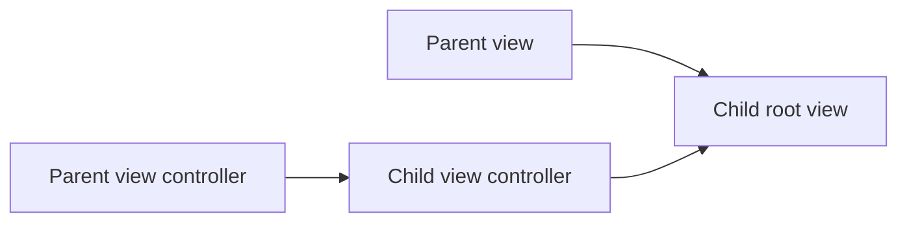

# Containment and Child View Controllers: Theory

[Concept overview](README.md) · [Interview questions](interview.md)

## Mental Model

Containment makes one view controller the parent of another. The parent owns the
child controller's lifetime and places the child's root view inside its own view.
UIKit can then send lifecycle, trait, rotation, and appearance updates through
the controller tree.



Use containment when a region of the interface has its own lifecycle,
dependencies, navigation, or state ownership. Use a plain `UIView` when the
region is only display and interaction without controller-level responsibilities.

## Adding a Child

The standard sequence is:

```swift
addChild(child)
view.addSubview(child.view)
child.view.translatesAutoresizingMaskIntoConstraints = false
NSLayoutConstraint.activate([
    child.view.leadingAnchor.constraint(equalTo: view.leadingAnchor),
    child.view.trailingAnchor.constraint(equalTo: view.trailingAnchor),
    child.view.topAnchor.constraint(equalTo: view.topAnchor),
    child.view.bottomAnchor.constraint(equalTo: view.bottomAnchor)
])
child.didMove(toParent: self)
```

`addChild(_:)` establishes the parent-child relationship and calls
`willMove(toParent:)` for the child. Adding the child's view places its interface
in the hierarchy. `didMove(toParent:)` tells the child the move is complete.

The relationship and the view hierarchy should match. If a child controller is
added but its view is not installed, UIKit has an incomplete picture. If a child
view is added without controller containment, lifecycle and appearance behavior
can be wrong.

## Removing a Child

Removal is the reverse:

```swift
child.willMove(toParent: nil)
NSLayoutConstraint.deactivate(childConstraints)
child.view.removeFromSuperview()
child.removeFromParent()
```

Remove constraints that the parent installed before removing the view.
`removeFromParent()` calls `didMove(toParent: nil)` for the child. Any child-owned
work should be cancelled by the child's lifecycle or by an explicit method before
removal, depending on the feature.

## Appearance Forwarding

UIKit's standard containers forward appearance callbacks to their children.
Custom containers also get automatic appearance forwarding by default. If a
custom container needs manual control, it can override
`shouldAutomaticallyForwardAppearanceMethods` and call
`beginAppearanceTransition(_:animated:)` and `endAppearanceTransition()`.

Manual appearance forwarding should be rare. It is easy to produce unbalanced
callbacks, especially during interactive transitions. Prefer standard containers
or default forwarding unless the container has a real custom transition model.

## Engineering Decisions

Containment is useful for:

- embedding a reusable flow inside several parent screens
- separating a complex screen into independently owned regions
- wrapping a child navigation controller
- isolating state and dependencies for a feature area

Containment adds cost:

- more lifecycle paths to test
- parent-child ownership to reason about
- appearance forwarding concerns
- possible communication complexity between parent and child

The parent should coordinate placement and high-level events. The child should
own its internal view hierarchy and feature state. Communication should be
explicit: delegation, closures, a shared model, or a coordinator. Avoid reaching
through several child levels to mutate internal views.

## Production Application

Containment bugs often appear as missing lifecycle events, duplicate appearance
events, broken safe area behavior, or leaked child controllers. In review, check
three things:

1. The containment calls are balanced.
2. The child view hierarchy matches the controller hierarchy.
3. Parent-child communication does not create retain cycles or hidden ownership.

At larger scale, define whether feature modules expose view controllers,
coordinators, or plain views. UIKit codebases often stay healthier when feature
teams expose a small factory that returns a controller plus a documented output
channel, rather than letting parents reach into child internals.

## References

- [Creating a Custom Container View Controller](https://developer.apple.com/documentation/uikit/creating-a-custom-container-view-controller)
- [Implementing a Container View Controller](https://developer.apple.com/library/archive/featuredarticles/ViewControllerPGforiPhoneOS/ImplementingaContainerViewController.html)
- [UIViewController](https://developer.apple.com/documentation/uikit/uiviewcontroller)
