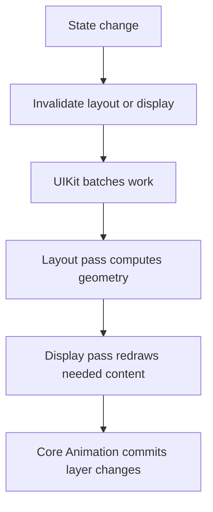

# Layout, Display, and Run Loop Updates: Theory

[Concept overview](README.md) · [Interview questions](interview.md)

## Mental Model

UIKit does not immediately recompute and redraw everything after every change.
It records that work is needed, then batches updates around the run loop and Core
Animation transaction commits. This keeps repeated changes efficient, but it
means frame and drawing results may not be current until layout and display have
run.



An interview answer should separate layout from display. Layout answers "where
are things?" Display answers "what pixels or layer contents should be drawn?"

## Layout Invalidation

Call `setNeedsLayout()` when a view's layout is no longer valid. UIKit schedules
a layout pass later. This is cheap and can be called multiple times before the
next pass.

Call `layoutIfNeeded()` when pending layout must happen now. A common use is
inside animations:

```swift
view.layoutIfNeeded()
heightConstraint.constant = 240

UIView.animate(withDuration: 0.25) {
    view.layoutIfNeeded()
}
```

The first call establishes the starting layout. The constraint change invalidates
layout. The second call inside the animation block asks UIKit to animate to the
new layout.

Use `layoutSubviews` in a custom view and `viewDidLayoutSubviews` in a view
controller when you need final bounds. Keep that work local. Calling
`setNeedsLayout()` from inside layout can create repeated passes if not guarded.

## Display Invalidation

Call `setNeedsDisplay()` when a view's drawn content is stale. UIKit schedules a
display update. This matters for custom drawing with `draw(_:)`. It is not the
right tool for changing constraints or subview frames.

Many UIKit changes do not require custom drawing. Changing a label's text,
setting a background color, updating an image view, or changing layer properties
usually uses existing view and layer machinery. Reserve `draw(_:)` for content
that really needs custom drawing.

## Run Loop and Core Animation

UIKit and Core Animation combine related changes into transactions. You can update
several properties in one turn of the run loop, and the system can commit the
result together. This is why repeated `setNeedsLayout()` calls are normally less
expensive than repeatedly forcing layout.

Forcing layout too often can cause performance problems. A table or collection
view cell that calls `layoutIfNeeded()` during every configuration may block
scrolling. A layout callback that performs network work, parses data, or rebuilds
large view trees can cause hitches.

## Engineering Decisions

Choose the invalidation based on what changed:

| Change | Typical invalidation |
|---|---|
| Constraint constant changed | Layout |
| Subview added or removed | Layout |
| Custom drawn color or path changed | Display |
| Text changed in a label | Usually view handles it |
| Layer shadow path depends on bounds | Update after layout |
| Animation between constraint states | `layoutIfNeeded()` inside animation |

Use `setNeedsLayout()` for normal deferred updates. Use `layoutIfNeeded()` when
the current code path needs final geometry now, such as animation setup,
measurement, or snapshot preparation. Treat forced layout as a cost to justify.

## Production Application

Layout and display bugs often show up as stale frames, flicker, janky scrolling,
or animations that jump. Debug by asking:

1. Was the correct thing invalidated: layout or display?
2. Is code reading frame values before layout has run?
3. Is forced layout happening inside a hot path?
4. Is a layout callback causing more invalidation?
5. Is custom drawing doing work better handled by layers or subviews?

At scale, define rules for cells and reusable views. Cell configuration should
set state and let UIKit batch layout. It should not repeatedly force layout,
decode large images, or draw synchronously while scrolling.

## References

- [UIView](https://developer.apple.com/documentation/uikit/uiview)
- [Drawing and Printing Guide for iOS](https://developer.apple.com/library/archive/documentation/2DDrawing/Conceptual/DrawingPrintingiOS/)
- [Core Animation Programming Guide](https://developer.apple.com/library/archive/documentation/Cocoa/Conceptual/CoreAnimation_guide/)
